# Гайд на мифического босса Пространствуса, Всепоглощающего

*Источник: Method, перевод с официальных русских названий способностей (Wowhead)*

## Упрощенный режим

**Общее:**

- Бой легче после нерфов, но все еще карает за ошибки.
- Используйте **2 Чернокнижника** для двойных врат в Ф1.
- Много заранее назначений, разбирайтесь с ними по фазам.

**Фаза 1:**

- Разделите рейд равномерно (баланс ДПС + утилити).
- Переходите во Ф2 около **4-е отбрасывание**, игнорируйте после этого.
- **Живые сгустки:**
- **[Расколотое пространство](https://www.wowhead.com/ru/spell=1243690):** Все, кроме танка, сосут мгновенно.
- **[Обратная гравитация](https://www.wowhead.com/ru/spell=1243577):**
- **Отбрасывания:**

**Фаза 2:**

- Назначьте **5 собирателей [Звездного сердечника](https://www.wowhead.com/ru/spell=1246930)** (по 7% каждый, 35% суммарного урона адду).
- Лекари берут верхние/нижние сферы, танк берет подплатформенные.
- Все остальные летят на платформу.

**Платформа 1 (Артошион):**

- Бросайте [Массовое уничтожение](https://www.wowhead.com/ru/spell=1249423) линии в зоне приманки.
- Сгруппируйте Нулевязателей на Хранителе пустоты (стяжки Рыцаря смерти + отбрасывание).
- Приоритет: Хранитель пустоты > Нулевязатель > Большой адд.
- 2 оглушения на набор Нулевязателей, пропущенное = вайп.
- Разберитесь с [Гравитационное искажение](https://www.wowhead.com/ru/spell=1234242) (стойте маленькими кругами внутри большого).
- Убейте до 2-го ветра.

**Платформа 2 (Паргот):**

- Те же механики, но с [Кольцо звездных осколков](https://www.wowhead.com/ru/spell=1249454) (назначьте 6 сосалов).
- Перевернутые гравитационные формации (сначала L → затем линия).
- Убейте после 2-го ветра если нужно, выбитых игроков стянут обратно.

**Фаза 3:**

- Сгруппируйтесь в ближнем бою, сжигайте босса, следите за уроном от появления звезд.
- **Волны:**
- **[Пожирание](https://www.wowhead.com/ru/spell=1229038):**
- **Финальный [Пожирание](https://www.wowhead.com/ru/spell=1229038):** Осталось 4 звезды, считайте 1-4, сосите соответственно.
- Конечный поток: **Гравитация > Волны > Гравитация > Волны > Убейте босса.**
- Для последних двух волн комната тесная, позовите первую волну и играйте безопасно.

## Механики

*(Нажмите на название способности, чтобы увидеть подробности)*

#### Обратная гравитация

Чтобы освободить игрока от [Обратная гравитация](https://www.wowhead.com/ru/spell=1243577), все сферы [Массивного сгустка](https://www.wowhead.com/ru/spell=1228206) должны быть подобраны и использованы, чтобы сосать того же игрока.

В отличие от героического режима, где несколько сосалов просто ускоряют процесс, в мифическом режиме вы **вообще не можете освободить игрока**, если не каждый носитель [Массивного сгустка](https://www.wowhead.com/ru/spell=1228206) сосет того же игрока.

#### Расколотое пространство

Большой круг, который сначала нужно уклониться, но как только он появится, все (кроме танков) должны встать внутри, чтобы уменьшить его.

Если не уменьшить вовремя, он взорвется и нанесет огромный урон той стороне комнаты.

#### Гравитационное искажение

Всегда нацеливается на одного ближнего боя, одного дальнего боя и одного лекаря.

Целевые игроки создают зоны [Инверсии гравитации](https://www.wowhead.com/ru/spell=1234244), которые защищают других от [Сокрушающей гравитации](https://www.wowhead.com/ru/spell=1234243), что иначе убило бы их, если бы они не стояли внутри одного из больших кругов.

См. раздел тактики для подробных установок формаций.

#### Массовое уничтожение (Артошион)

Направляет на четырех случайных игроков, выпуская лучи, которые отбрасывают их назад и оставляют лужи пустоты, наносящие урон и замедляющие движение.

Отойдите из рейда, чтобы бросить их, но избегайте задевания других игроков.

#### Звездная осколочная вспышка (Паргот)

Запускает три сферы в направлении одного случайного игрока, заставляя рейд **приманить** эту способность на конкретную сторону, чтобы облегчить сосание.

Каждая сфера взрывается при столкновении, оставляет большую лужу пустоты и накладывает дебафф тяжелого урона, длительностью одну минуту.

Если тот же игрок сосет дважды, или если сфера пропущена, это вызывает массивный взрыв, который убивает рейд.

#### Гравитационное искажение

Та же способность, что во Фазе 2, но теперь она всегда происходит вместе с **хватом танка**, либо прямо перед, либо во время хвата.

Это заставляет танка позиционироваться осторожно, чтобы избежать вытаскивания игроков из позиции.

См. раздел тактики для подробного руководства по позиционированию.

## Тактика

С недавними нерфами боя и приростом силы от экипировки и известности этот бой намного легче, чем во время гонки за первое мировое убийство (RWF). Однако он все еще требует точного выполнения от начала до конца, так как есть бесчисленные способы умереть или получить вайп.

По-прежнему рекомендуется использовать двух Чернокнижников для двойных врат, что делает прохождение Фазы 1 гораздо более стабильным.

Этот бой сильно основан на заранее назначениях, но вместо того, чтобы перечислять все сразу, каждая фаза ниже включает назначения, относящиеся к ней, для ясности.

### Фаза 1

Разделите рейд на две равные группы, балансируя урон и утилити. Убедитесь, что каждая группа имеет доступ к Спирали времени или Спасению при необходимости, в зависимости от состава.

Большинство гильдий переведет босса во Фазу 2 около четвертого отбрасывания, так что если вы достигнете 4-го, можно безопасно игнорировать механики после этого и просто давить до 0%.

#### Живые сгустки

Назначьте трех игроков с каждой стороны, чтобы подбирать сферы, выпадающие с первого набора аддов на пуле. Эти игроки потеряют свои стаки сразу после первого [Пожирания](https://www.wowhead.com/ru/spell=1229038), что происходит почти сразу.

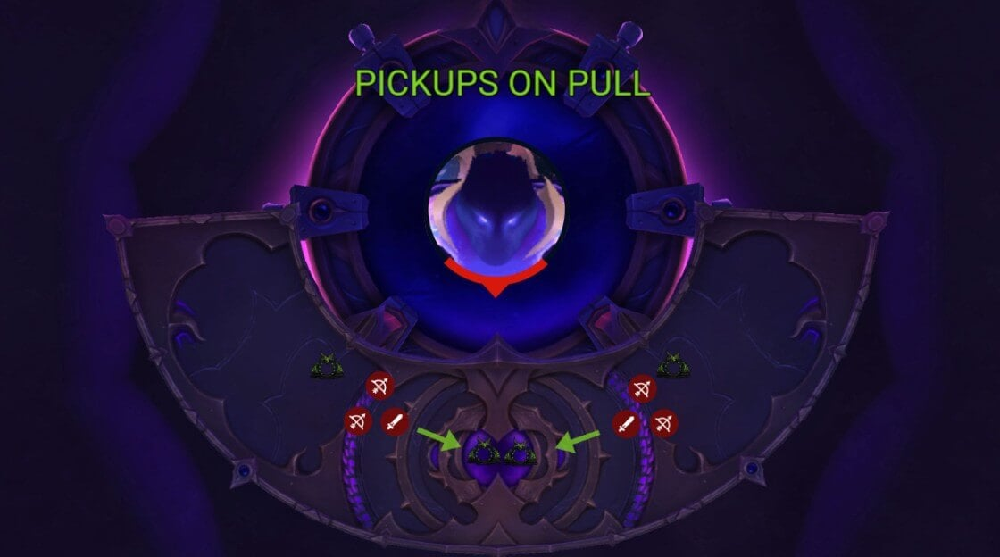

Далее назначьте восьмерых игроков разбираться со всеми остальными Живыми сгустками на протяжении Ф1:

- **1-й набор:** 4 лекаря, это держит лекарей на земле и исцеляет
- **2-й набор:** 2 ближнего боя и 2 дальнего боя
- **3-й набор:** те же игроки, что и в первом наборе

Убийство Живых сгустков — главный приоритет. Здоровье босса щадящее, и в большинстве случаев вам даже придется остановить ДПС для таймингов поздних кулдаунов. Чем быстрее умирают адды, тем плавнее прогрессия.

**Почему это важно:** Меньше урона рейду, быстрее сбор сфер, меньше шанс, что Живые сгустки исцелятся до полного.

Второй пункт особенно важен. Если адды умирают поздно, игрок может подобрать сферу как раз когда [Обратная гравитация](https://www.wowhead.com/ru/spell=1243577) выходит. Если этот игрок затем получает гравитационный круг, обе цели фактически мертвы, так как вы теряете одного из необходимых [Массивный сгусток](https://www.wowhead.com/ru/spell=1228206) чтобы освободить их.

#### Расколотое пространство

Как только появится большой круг, после уклонения от вихря, каждый доступный игрок, кроме танка, должен немедленно встать внутрь, чтобы уменьшить его как можно быстрее.

Если Живые сгустки были разобраны правильно, они должны умереть как раз когда начинается эта механика.

#### Обратная гравитация

Это всегда нацеливается на игроков без [Массивный сгусток](https://www.wowhead.com/ru/spell=1228206), так что в идеале у вас есть постоянные спасатели каждый раз.

В мифическом режиме, все [Массивный сгусток](https://www.wowhead.com/ru/spell=1228206) игрока должны сосать ту же цель, чтобы освободить их.

Цели должны позиционироваться как на вашей схеме, [Массивный сгусток](https://www.wowhead.com/ru/spell=1228206) освобождает спереди стоящего игрока сначала, затем сзади стоящего.

- 1-й и 3-й наборы используют **2** [Массивного сгустка](https://www.wowhead.com/ru/spell=1228206) на игрока.
- 2-й набор использует **4** [Массивного сгустка](https://www.wowhead.com/ru/spell=1228206) на игрока.

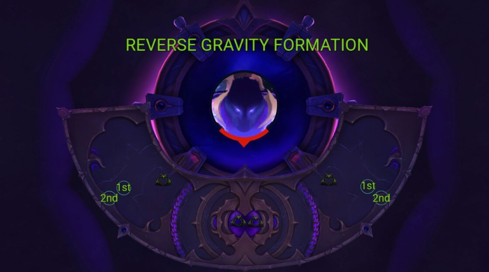

Если хоть один игрок опаздывает или не на позиции, никто не освобождается. Каждый игрок с [Массивным сгустком](https://www.wowhead.com/ru/spell=1228206) должен обязаться сосать, пока цель не освободится или он не умрет. Ранний уход часто вызывает вайпы.

#### Отбрасывания

У вас будет три основных отбрасывания, которые нужно правильно отыграть, с потенциальным четвертым, где вы можете пойти “йоло” и давить босса.

**1-е отбрасывание:** всех отбрасывают в назначенные точки, и они бросают там лужи.

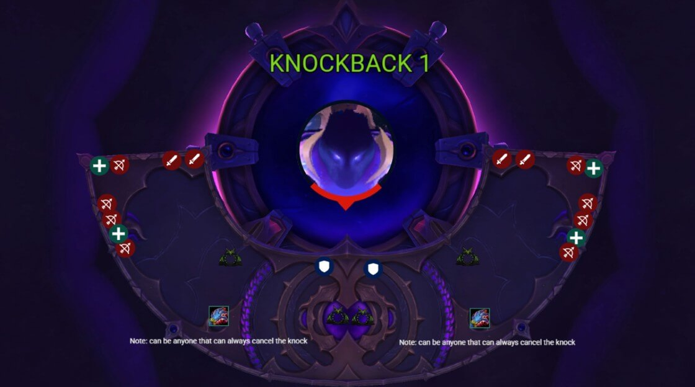

**2-е отбрасывание:** отмените, стяните или Спасите отбрасывание, затем бросайте лужи в назначенной области.

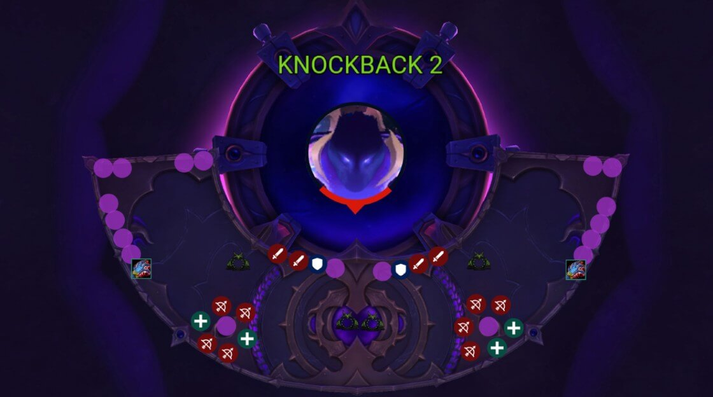

**3-е отбрасывание:** снова обычное отбрасывание, позиции скорректированы, так как предыдущие зоны покрыты.

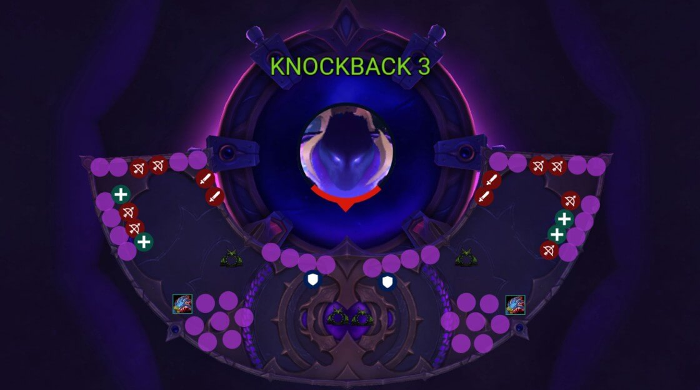

4-е отбрасывание, отмените или получите спасение, затем давите босса, избегайте луж. Каждый сам решает, как бросать лужи.

#### Собирая Ф1 воедино:

- Войдите в свой портал на назначенную сторону. Убейте шесть аддов, три с каждой стороны, подберите сферы и сгруппируйтесь в центре.
- После первого [Пожирание](https://www.wowhead.com/ru/spell=1229038), двигайтесь на свои стороны и готовьтесь к первому отбрасыванию, обычное. Бросайте лужи и убивайте двух новых аддов с каждой стороны. Прерывайте их исцеление, иначе это вайп.
- Назначенные игроки хватают сферы, все сосут [Расколотое пространство](https://www.wowhead.com/ru/spell=1243690), цели [Обратной гравитации](https://www.wowhead.com/ru/spell=1243577) занимают позиции.
- [Массивный сгусток](https://www.wowhead.com/ru/spell=1228206) освобождает спереди стоящего, затем сзади стоящего.
- На втором отбрасывании отмените или Спасение, бросайте лужи и повторяйте. Четыре игрока с Массой с каждой стороны должны сосать вместе.
- После освобождения всех целей гравитации используйте врата в центр для [Пожирания](https://www.wowhead.com/ru/spell=1229038). Игроки без Массы могут взять рано, игроки с Массой ждут, пока их работа не будет выполнена.
- После этого займите позицию для третьего отбрасывания, зеркало первого.
- Давите босса около тайминга 4-го отбрасывания.

#### Стратегия скорости (опционально)

Для более быстрых убийств переходите во Фазу 2 после 2-го [Пожирания](https://www.wowhead.com/ru/spell=1229038), прямо после 3-го отбрасывания. Игнорируйте остальное и сжигайте босса.

Типичный переход около 2:10.

#### Использование кулдаунов

- 1:30 — По кулдауну.
- 2:00 — Пул, затем Платформа 1, затем начало Ф3.
- 3:00 — Пул, затем удержание для Ф3.

### Фаза 2

В начале назначьте пятерых игроков собирать [Звездный сердечник](https://www.wowhead.com/ru/spell=1246930). Каждый сжигает **7%** от здоровья адда, так что вы можете нанести до 35% урона до приземления.

В начале берите все сердечники. Позже пропустите несколько, чтобы продлить фазу, если ваш урон по аддам слишком высок.

#### Основные опорные клипы

**Сферы сверху слева:**

- ЛЕВО: [Видео](https://web.archive.org/web/20260218180243/https://www.twitch.tv/sanghelioswow/clip/IgnorantComfortableQueleaMVGame-qvH_UVHi8yVfrjmM)
- ПРАВО: [Видео](https://web.archive.org/web/20260218180243/https://www.twitch.tv/driney/clip/EasyScaryPidgeonMau5-lUm_iaezPmkdq0Uf)

**Сферы снизу:**

- ЛЕВО [Видео](https://web.archive.org/web/20260218180243/https://www.twitch.tv/velowow/clip/KindApatheticMetalImGlitch-3magD6Fr22GPxK6H?filter=clips&range=7d&sort=time)
- ПРАВО: [Видео](https://web.archive.org/web/20260218180243/https://www.twitch.tv/rycn/clip/EnticingShyOysterDoritosChip-MHhDNYEDg09-rD2S?filter=clips&range=30d&sort=time)

**Под платформой:** [Видео](https://web.archive.org/web/20260218180243/https://www.twitch.tv/andybrew3/clip/SmokyLitigiousPassionfruitDatSheffy-7WRsyL80hMSe03z3)

Рекомендуется: верхнюю и нижнюю должны делать лекари, а танк — подплатформенные.

Вот позиции всех сердечников, летящих к Платформе 2:

- Верх (2 сферы Слева + Справа): [Видео](https://web.archive.org/web/20260218180243/https://www.twitch.tv/sanghelioswow/clip/ExuberantAmorphousChowderBuddhaBar-RuD1-XtsAt4VrHih)
- Низ (2 сферы Слева + Справа): [Видео](https://web.archive.org/web/20260218180243/https://www.twitch.tv/velowow/clip/ToughGiftedShieldItsBoshyTime-qEc7pcKgevoy2958?filter=clips&range=30d&sort=time)
- Под платформой (Танк): [Видео](https://web.archive.org/web/20260218180243/https://www.twitch.tv/andybrew3/clip/TangentialHelpfulHornetPogChamp-vnfVNqu3aXIdYBzz)

Все остальные должны просто лететь на платформу, как в героическом режиме.

#### Платформа 1 (Артошион)

Позиционируйтесь так же, как на Платформе 2, для единообразия. Четверо игроков становятся целью [[Выброс материи]](https://www.wowhead.com/ru/spell=1237694), урон линией, отбрасывание, лужи. Бросайте линии в зоне приманки, остальные уклоняются. Просите стяжки или Спасения, если вам трудно вернуться.

Назначьте двух Рыцарей смерти для трех стяжек, и одного отбрасывания, чтобы сгруппировать **Нулевязателей** поверх **Хранителя пустоты**.

Приоритет: Хранитель пустоты, затем Нулевязатель, затем большой адд, с периодический урон на противоположном Хранителе пустоты.

Назначьте два оглушения на набор Нулевязателей, пропущенные касты = вайп.

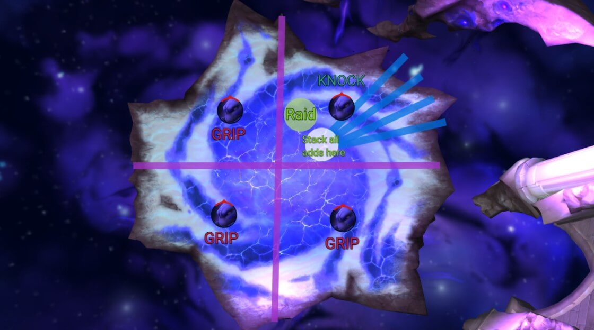

После этого ждите каст камня босса и двигайтесь через платформу.

Трое игроков получают [Инверсия гравитации](https://www.wowhead.com/ru/spell=1234244) большие круги, всегда один ближний бой, один дальний бой, один лекарь. Все остальные получают [Сокрушающая гравитация](https://www.wowhead.com/ru/spell=1234243) маленькие круги.

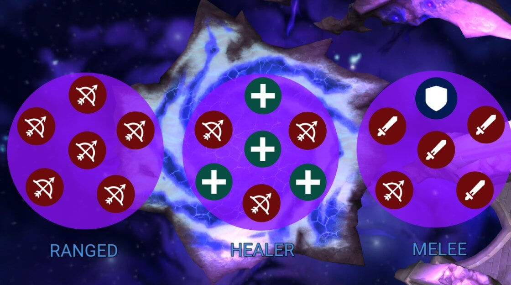

Маленькие круги наносят огромный урон и оглушают, если вы не стоите внутри большого круга, стояние внутри нейтрализует это.

Это повторяется в Фазе 3 с другими формациями.

В зависимости от состава, вам может понадобиться отправить некоторых ближников в группу лекарей или некоторых дальников в группу ближников, однако помните, что это значит, что эти игроки должны будут адаптироваться на лету.

Если дальник, стоящий в группе ближнего боя, получает круг, ему нужно вместе с ним перейти в группу дальников. Это потому, что гарантированно получают 1 лекарь, 1 дальний бой, 1 ближний бой, то есть если дальник пойдет в ближний бой со своим кругом, то у вас получится 2 круга там, так как ближник с кругом тоже естественно передвинется в эту позицию.

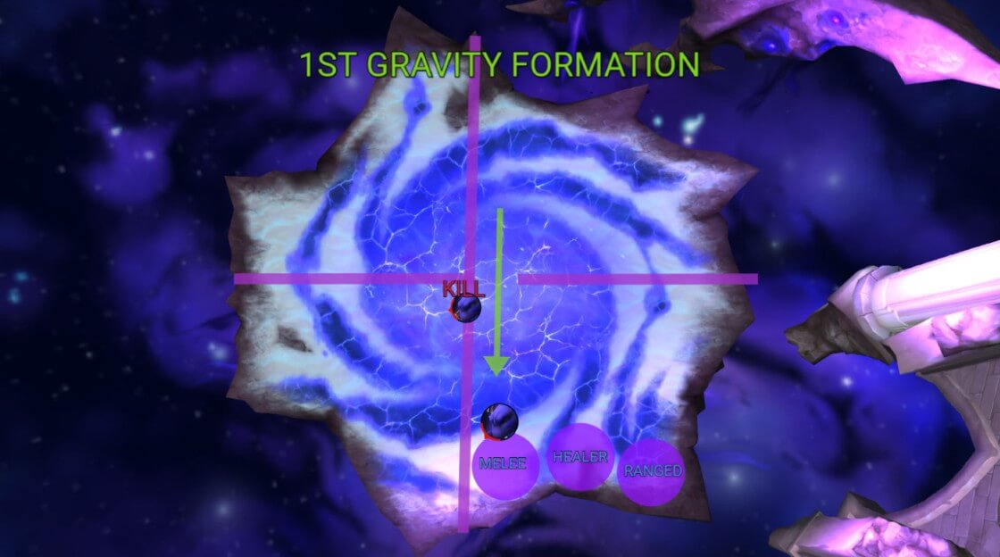

Когда камень пролетает через платформу, готовьтесь к ветрам. Держите Артошиона на месте, пока [[Выброс материи]](https://www.wowhead.com/ru/spell=1237694) не закончится, некоторым игрокам может понадобиться Спасение.

Повторяйте цикл, используйте врата Чернокнижника, если достигнете еще одного каста камня.

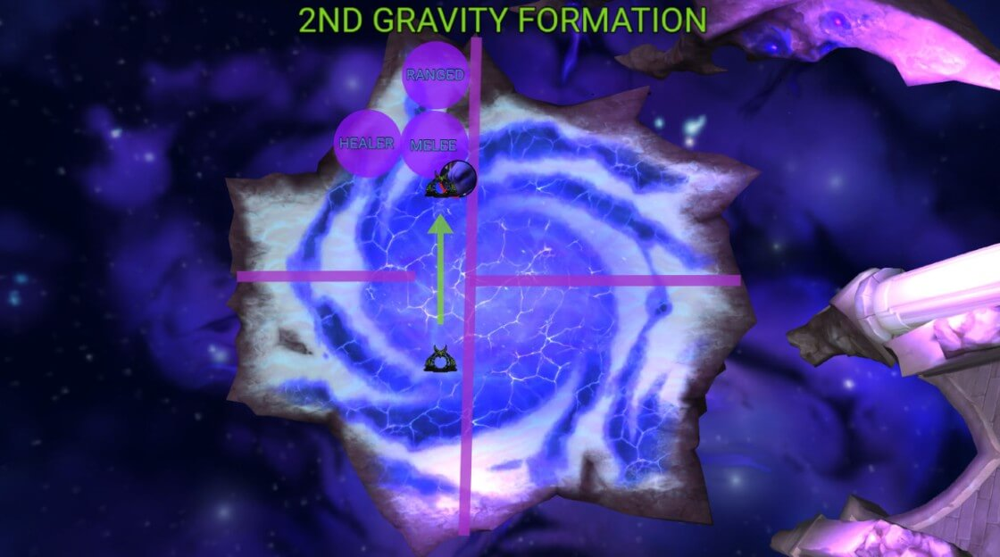

Убейте Артошиона до вторых ветров.

#### Платформа 2 (Паргот)

Играет так же, как Платформа 1, кроме [Кольцо звездных осколков](https://www.wowhead.com/ru/spell=1249454) заменяет [[Выброс материи]](https://www.wowhead.com/ru/spell=1237694), и гравитационные формации перевернуты.

Отметьте одного игрока, все приманивают на них. Паргот нацеливается на случайного игрока и выпускает три сферы в этом направлении.

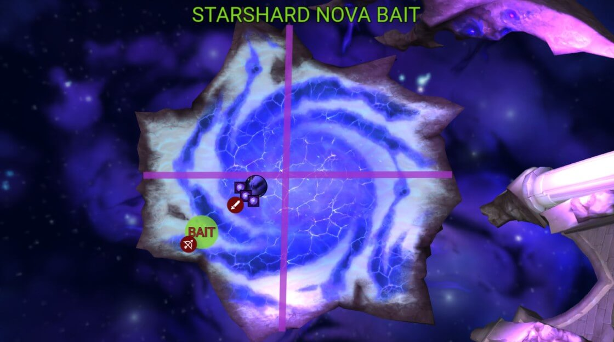

Назначьте шесть сосалов, двух танков, двух лекарей, желательно Пробудителя или Мага. Каждый берет одну сферу. Дебафф длится одну минуту, лекари следят за этими игроками. 3 игрока за набор.

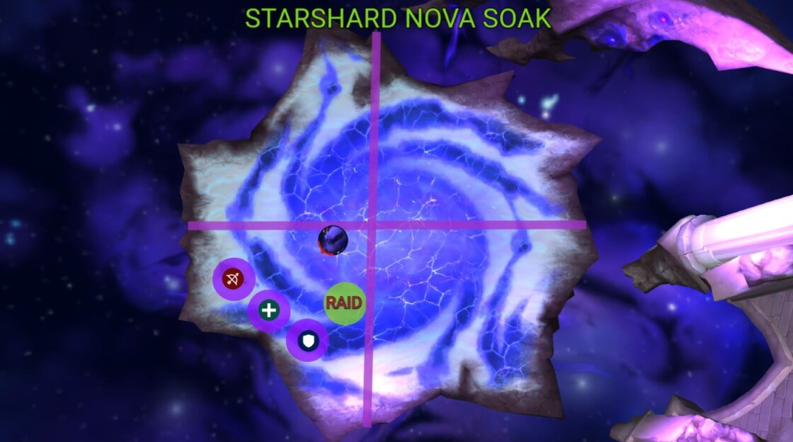

Когда начинается каст камня, войдите в **L-формация** сначала, затем **линейная формация** второй, противоположный Платформе 1.

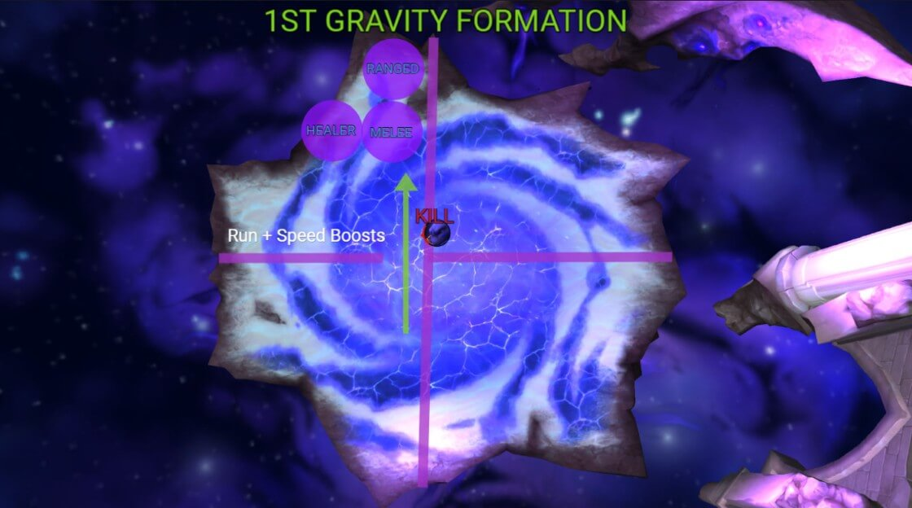

Как только вы разберетесь с ветрами, вам нужно как можно скорее занять позицию приманки и разобраться с [Кольцо звездных осколков](https://www.wowhead.com/ru/spell=1249454) так же, как вы делали в первый раз, но на этот раз с другими игроками, иначе ба-бах.

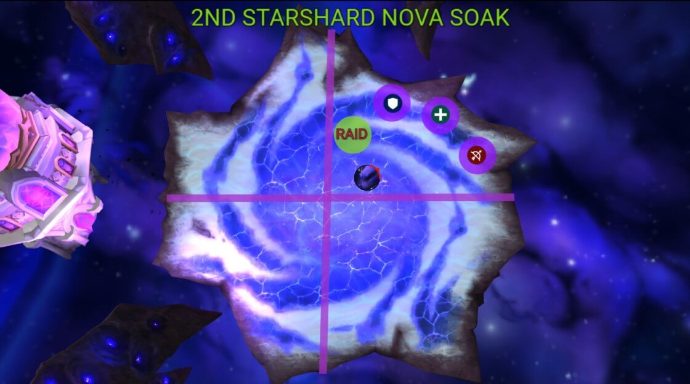

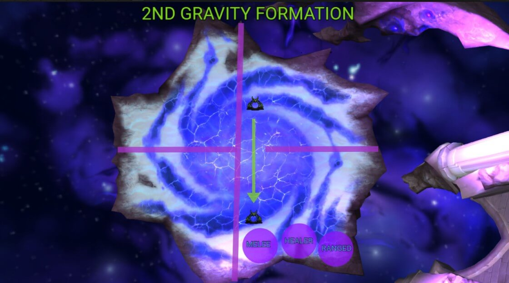

Если ДПС низкий или вы хотите более чистые тайминги, вы можете убить Паргота после вторых ветров, что нормально. Любого, кто выбит после его смерти, стянут обратно для Фазы 3.

### Фаза 3

Если вы достигли Ф3, вы близки к убийству. С нерфами и экипировкой это самая легкая фаза, но ошибки все еще смертельны.

Начните сгруппированными в ближнем бою и бейте босса, как в героическом режиме. Урон может всплескивать при появлении звезд, будьте готовы.

Разберитесь с первым набором волн. Двигайтесь к первой видимой волне, влево или вправо, и получите удар как можно скорее. Для второй волны дождитесь спадения дебаффа, затем получите удар. Для третьей дайте ей прийти к вам, где вы стоите.

Затем наступает первый [Пожирание](https://www.wowhead.com/ru/spell=1229038). Поставьте метку напротив стака ближнего боя с начала Ф3, назначьте группы, 1 и 2 слева, 3 и 4 справа. Войдите в свою звезду примерно **1,5 секунды** до окончания каста, чтобы минимизировать урон.

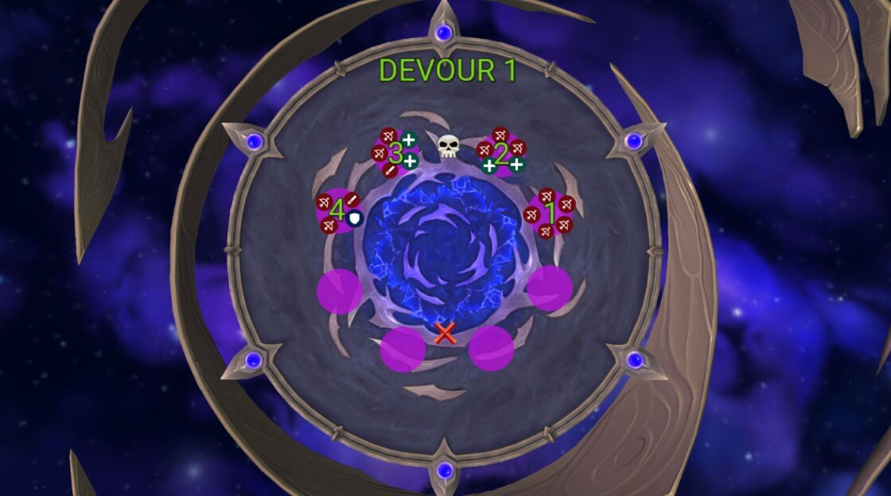

После [Пожирание](https://www.wowhead.com/ru/spell=1229038), бегите на противоположную сторону, область начала Ф3. Готовьтесь к гравитации через **линейная формация**, но сначала вы получите хват танка. Займите позицию заранее и позвольте хвату притянуть вас, это сохранит формацию нетронутой. Используйте здесь защитные кулдауны.

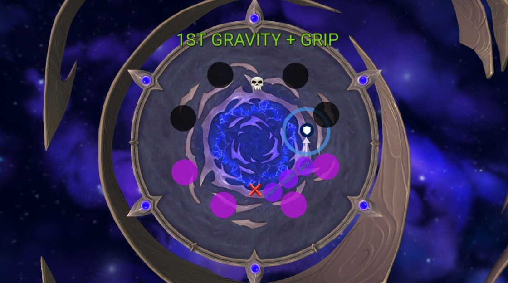

Далее больше волн. Получите удар первых двух быстро, затем дождитесь спадения дебаффа для третьей, стоя на максимальной дистанции у края.

Следует еще один набор гравитации, на этот раз **L-формация**, до хвата танка. Отметьте третью живую звезду как опорную точку.

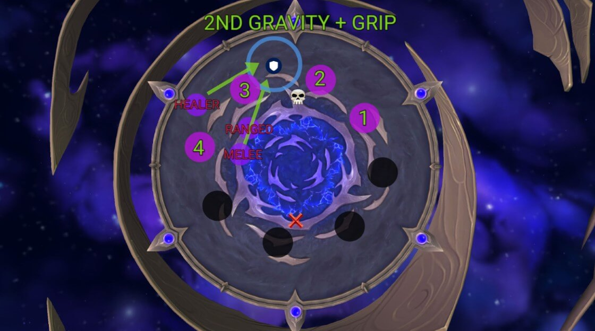

После этого у вас будет еще одна последовательность колец плюс гравитация. Делайте то же самое, кроме того, что эта попадает во время хвата танка, так что как только вы на позиции, все должны перестать двигаться для хвата, чтобы позиции не сместились, пока [В воздухе](https://www.wowhead.com/ru/spell=1243609).

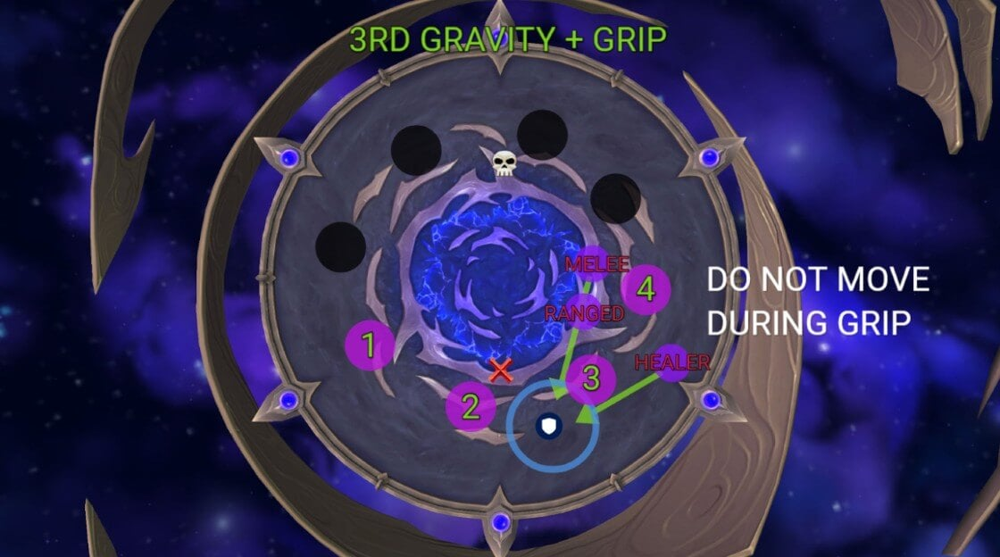

Для второго, последнего [Пожирания](https://www.wowhead.com/ru/spell=1229038), остаются только четыре звезды. Считайте их от 1 до 4 от первой живой. Бегите на противоположную сторону, сгруппируйтесь и лечите сквозь.

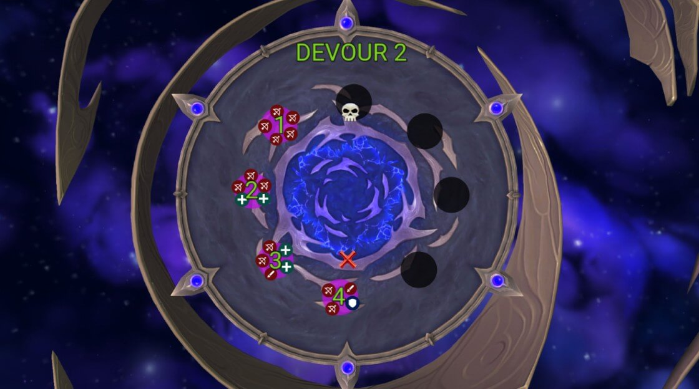

Последние две гравитации легкие. Встаньте на отмеченные точки и держитесь против хвата, оба набора приземляются до хвата танка.

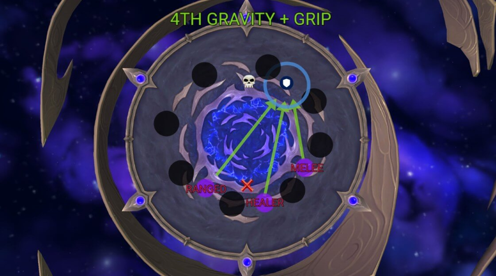

**Конечный поток:** Гравитация, волны, гравитация, волны, убейте босса или вайп.

Для последних двух наборов волн комната уже мала, и волны могут появиться в зонах пустоты. Кто-то зовет первую волну, приблизьтесь, играйте безопасно.

Как только вы переживете эту последовательность, босс умрет.
