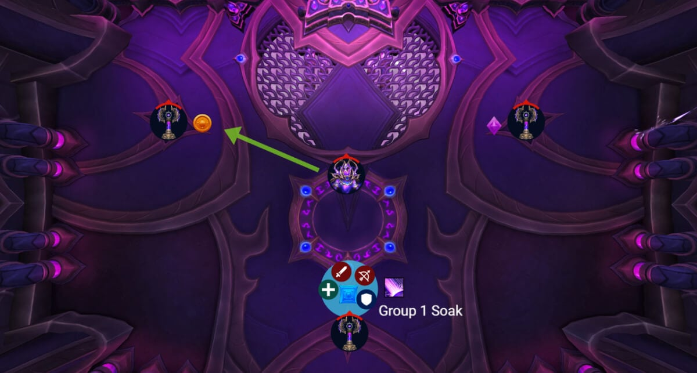
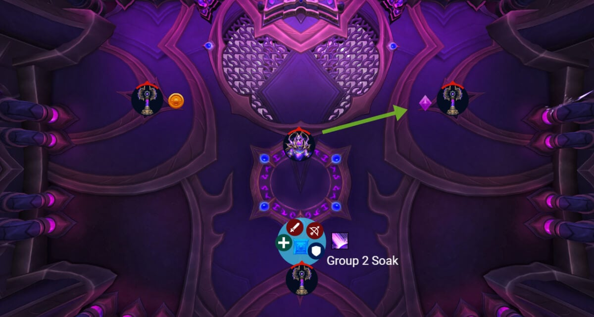
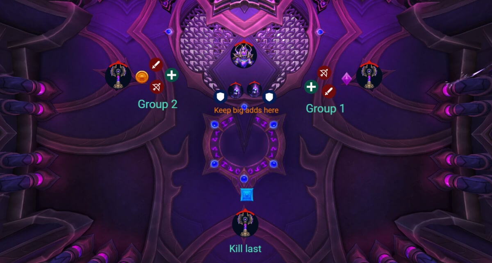
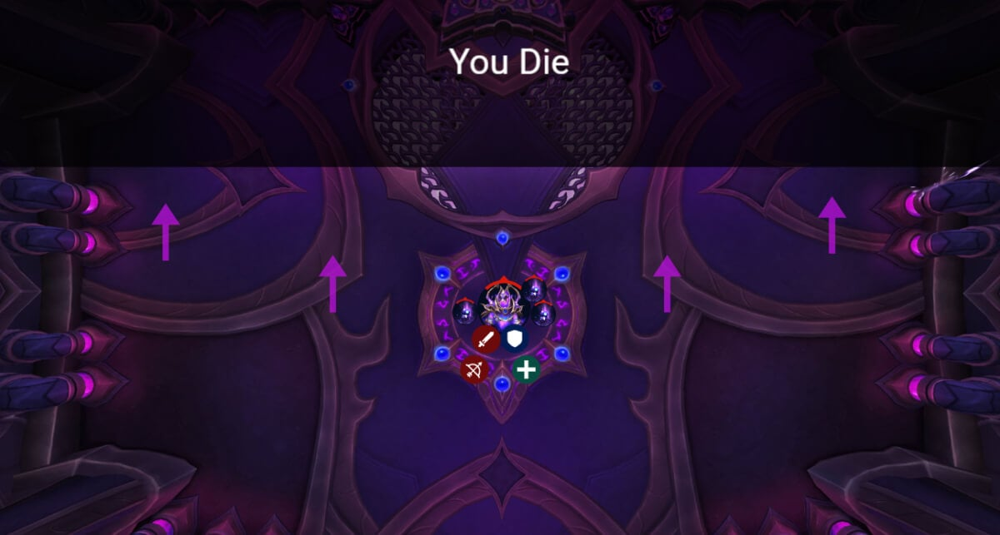

# Гайд на героического босса Кузнец-ткач Араз

*Источник: Method, перевод с официальных русских названий способностей (Wowhead)*

## Упрощенный режим

**Фаза 1:**

- Потяните босса влево (оранжевый), чтобы активировать первого сборщика.
- Сок [Чародейского уничтожения](https://www.wowhead.com/ru/spell=1228218) внизу (синий) и породите там большого адда.
- Цели [Астральной жатвы](https://www.wowhead.com/ru/spell=1228214) идут к синему, чтобы сгруппировать маленьких аддов с большим.
- Переместите босса вправо (фиолетовый), чтобы активировать следующий сборщик.
- Повторите сок [Чародейского уничтожения](https://www.wowhead.com/ru/spell=1228218) и [Астральную жатву](https://www.wowhead.com/ru/spell=1228214) на синем.
- После 2 соков породите оставшихся маленьких аддов в центре и зачистите их.
- Держите Отголоски на расстоянии 20+ ярдов от босса.
- Уворачивайтесь от вихрей Бури.
- Замедляйте или убивайте Воплощения, прежде чем они достигнут сборщика.

**Переходная фаза:**

- Разделите рейд на две группы; отправьте одну к фиолетовому, другую к оранжевому.
- Убейте обоих Сборщиков до [Чародейской конвергенции](https://www.wowhead.com/ru/spell=1226260).
- [Радужное средоточие](https://www.wowhead.com/ru/spell=1232412): при 100 энергии Сборщик направляет луч. Танки Защищённых служителей должны держать их близко к Сборщику и в луче, все остальные избегают луча.
- Как только Сборщики мертвы, отведите аддов к боссу и уничтожьте их во время 12-секундного усиления урона.
- Убивайте аддов после окончания усиления урона, чтобы избежать смертей танков от накапливающейся скорости атаки.

**Повтор Фазы 1:**

- То же, что и раньше; используйте синий для соков и Жатв.
- Породите оставшихся аддов в середине, как только все Сборщики активны.

**Вторая переходная фаза:**

- То же, что и первая переходная фаза, но теперь вы уворачиваетесь от круговых ударов вместо линий.
- Убивайте Сборщиков, сбивайте босса во время усиления урона и зачищайте аддов.

**Фаза 2 (Бурст):**

- Постоянное притяжение к центральной Сингулярности. Используйте передвижение, чтобы сопротивляться.
- Убивайте Воплощения, прежде чем они достигнут края.
- Породите их прямо на боссе, чтобы зачистить.
- Избегайте вихрей.
- Сфокусируйтесь на боссе, пока притяжение не убьёт вас.

## Тактика

Начните пул, отведя босса к левому сборщику (оранжевый маркер). Это активирует этого сборщика первым, что нам и нужно. Бой всегда начинается с одной и той же последовательности: сначала идёт групповой сок ([Чародейское уничтожение](https://www.wowhead.com/ru/spell=1228218)), затем дебафф, который порождает маленьких аддов ([Астральная жатва](https://www.wowhead.com/ru/spell=1228214)).

Как только сборщик активен, переместите босса в середину комнаты. Когда появляется групповой сок, пусть все сделают его на нижней стороне (синий маркер). Там появляется большой адд (Чародейский отголосок), и поскольку он далеко от босса, это не активирует бафф, который случается, если босс и Отголосок слишком близко (вы точно этого не хотите).

После этого босс нацеливается на 3 игроков [Астральной жатвой](https://www.wowhead.com/ru/spell=1228214). Каждый из них породит маленького адда (Чародейское воплощение) в своём местоположении. Отправьте всех 3 игроков к синему маркеру, чтобы все адды сгруппировались с большим Отголоском. Это облегчает зачистку и поддерживает порядок для следующего сборщика.

Как только всё это пройдёт, переместите босса на правую сторону (фиолетовый маркер), чтобы активировать второго сборщика.

Следующий групповой сок и следующая [Астральная жатва](https://www.wowhead.com/ru/spell=1228214) тоже должны идти к синему, как и раньше. Так что мы по сути собираем всю опасность в один угол и не разбрасываем хаос по всей комнате.

Вы получите только 2 [Чародейских уничтожения](https://www.wowhead.com/ru/spell=1228218) в этой фазе, но вы получите несколько [Астральных жатв](https://www.wowhead.com/ru/spell=1228214). Это означает, что как только все 3 сборщика активированы (левый, правый, нижний), любые дальнейшие маленькие адды должны появляться в центре комнаты. Просто соберите их и уничтожьте как можно скорее, прежде чем они создадут проблемы.

При 100 энергии Араз начинает переходную фазу.

Разделите рейд на две равные DPS-группы. Одна идёт к фиолетовому сборщику, другая к оранжевому. Вы хотите убить этих двоих до применения [Чародейской конвергенции](https://www.wowhead.com/ru/spell=1226260), иначе рейд получит 4 миллиона урона за каждого выжившего сборщика; не идеально. Как только [Радужное средоточие](https://www.wowhead.com/ru/spell=1232412) применяется к случайному сборщику, игрокам нужно выйти из него, поскольку он наносит огромный урон в течение нескольких секунд.

В то же время появляются два больших адда (Защищённый служитель). Танки должны забрать их и переместить к сборщику с наибольшей энергией, потому что когда он достигнет 100, он направит луч ([Радужное средоточие](https://www.wowhead.com/ru/spell=1232412)) в середину комнаты; этот луч наносит огромный урон по всему рейду. Если между ними находятся адды, они прервут луч и поглотят урон вместо этого. Сборщик, который начинает с наибольшей энергией, случаен, но дальше вы видите, какой следующий получит энергию, так что просто перемещайте аддов соответственно.

Все остальные должны следить за тем, чтобы избегать луча.

Как только все три сборщика мертвы, отведите обоих Защищённых служителей к боссу, потому что Араз входит в 12-секундную фазу получения 100% урона. Это ваше окно для бурста. Используйте всё.

После окончания бурста переключите всё внимание на Служителей. Они накапливают скорость атаки со временем, ударяя одну и ту же цель, так что если оставить их живыми слишком долго, они абсолютно раздавят ваших танков.

После переходной фазы бой повторяется с начала. Вы будете активировать сборщиков и управлять аддами точно так же, как и раньше.

Та же идея, что и в первой переходной фазе, но на этот раз вы уворачиваетесь от кругов вместо линий. В остальном разделитесь и сбейте сборщиков, как и раньше. Используйте окно бурста, затем снова убейте Защищённых служителей.

Как только всё это сделано, вы входите в финальную фазу. Это полный бурст.

Всех постоянно притягивает к краю арены [Мрачная сингулярность](https://www.wowhead.com/ru/spell=1233076). Если вас засосёт, вы умрёте. Используйте способности передвижения.

[Aстральная жатва](https://www.wowhead.com/ru/spell=1228214) тоже продолжает происходить здесь, но теперь маленькие адды появляются и начинают бежать к краю. Если они достигнут его, они взорвут рейд, точно так же, как если бы они достигли сборщика в фазе один. Просто породите их прямо на боссе, и зачищайте их, пока вы бьёте босса.