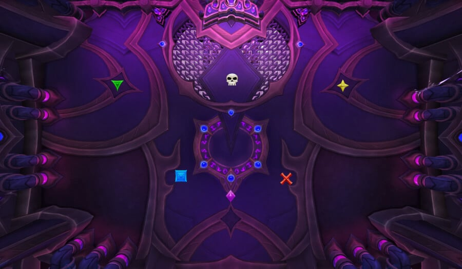

# Гайд на мифического босса Кузнец-ткач Араз

*Источник: Method, перевод с официальных русских названий способностей (Wowhead)*

## Упрощенный режим

**Фаза 1:**

- Переместите босса к [Прорыву Бездны](https://www.wowhead.com/ru/spell=1248171), породите аддов, убейте аддов + Отголосок.
- Соки: по 10-12 игроков каждый. Используйте иммунитеты (Маги, Паладины, Разбойники, АМС ДК) для двойных соков.
- Всего 6 наборов аддов. Последний набор перекрывается с отбрасыванием + переходной фазой — сгруппируйтесь в ближнем бою, используйте рейдовые КД, сбейте аддов быстро.
- Уворачивайтесь от кругов [Усмиряющей бури](https://www.wowhead.com/ru/spell=1228188) любой ценой.

**Переходная фаза 1:**

- Разделите рейд равномерно между Сборщиками. Все должны умереть в течение 10 сек.
- Мульти-доттеры на разных сторонах.
- Используйте защитные способности при 5-6 стаках [Астрального ожога](https://www.wowhead.com/ru/spell=1240705).
- Убейте Служителей + Отголосок после усиления урона.

**Фаза 2:**

- Только 3 [Прорыва Бездны](https://www.wowhead.com/ru/spell=1248171) + 1 сок. То же обращение, что и на Ф1.
- Не убивайте Отголосок, просто фармьте ресурсы с него.
- Последний Разлом: сгруппируйтесь в ближнем бою, сильный AoE по аддам.

**Переходная фаза 2:**

- То же, что и первый, но с большим количеством кругов.
- Используйте **Герой/Жажду** раньше (когда у Сборщика ~20–30%).

**Фаза 3:**

- Начните у стены для отбрасывания.
- Породите аддов на боссе и убейте, прежде чем они достигнут чёрной дыры.
- Держите Отголосок подальше и игнорируйте его.
- Сбейте босса, пока отбрасывания не подавят вас.

## Тактика

Этот бой — явный шаг вперёд по сравнению с героической версией, но благодаря нескольким уже введённым нерфам у вас не должно быть слишком много проблем с быстрым прохождением.

Самое большое изменение — добавление [Прорыва Бездны](https://www.wowhead.com/ru/spell=1248171). Эта механика заставляет ваш рейд либо отбросить чародейских аддов в разлом, либо породить их за разломом, чтобы они прошли сквозь него по пути к Чародейскому сборщику.

Этот бой также очень щедр в отношении требований к исцелению, поэтому мы предлагаем играть с 3 лекарями, потому что дополнительный ДД делает бой намного проще по сравнению с дополнительным лекарем.

**Маркеры**

| Маркер | Роль |
|--------|------|
| Череп | Босс |
| Синий | Соки / Адды |
| Крест | Прорыв Бездны |

### Фаза 1

**Стратегия**

Когда босс пуллится, есть три возможных места появления [Прорыва Бездны](https://www.wowhead.com/ru/spell=1248171):

- Череп
- Синий
- Крест

Допустим, первый Разлом появляется на Синем. Переместите босса туда, породите аддов, и убейте всё. Добейте Отголосок, прежде чем вернуться к боссу, но убедитесь, что отвели босса подальше, как только появится Отголосок.

**Соки (Чародейское уничтожение)**

Каждый сок требует около 10-12 игроков. Проблема в том, что некоторые соки перекрываются с появлением аддов, что затрудняет равномерное разделение рейда без ослабления контроля над аддами.

**Чтобы решить это:** Используйте игроков с двойным соком с иммунитетами. Например, ДК с АМС не получат дебафф на первом соке и могут помочь на втором. Маги, Священные Паладины и Разбойники отлично подходят для этого.

Это позволяет вам собрать 12+ игроков на первом соке (получая мало или никакого урона) и всё ещё иметь 10-12 на втором.

Третий сок происходит на Фазе 2. Все должны быть снова готовы, так что просто назначьте группу с самым лёгким путём к нему.

**Прорывы Бездны и появление аддов**

Второй [Прорыв Бездны](https://www.wowhead.com/ru/spell=1248171) появится на одном из оставшихся маркеров (не на том же, что и первый). Переместите босса к нему и породите аддов там. В то же время выходит второй сок; разместите его на противоположном маркере, и Группа 2 должна сразу направиться туда.

Этот Отголосок игнорируется. Танки держат его в движении по комнате, пока на него накладываются доты и он пассивно зачищается. Он должен умереть сразу после первой переходной фазы.

После второго сока вы разберётесь с ещё четырьмя [Прорывами Бездны](https://www.wowhead.com/ru/spell=1248171), но больше нет соков на этой фазе. Просто перемещайте босса от разлома к разлому и убивайте аддов.

**Распределение контроля**

Если вы используете стратегию с отбрасыванием, каждый набор аддов должен иметь:

- 1x Отбрасывание
- 1x Оглушение
- Опционально: Угнетающий рев
- Опционально: Вихрь/Выстрел-связка/Копьё

Отбрасывание + оглушение обычно достаточно, но сильный AoE обязателен.

Игроки должны пиксельно сгруппироваться перед [Прорывом Бездны](https://www.wowhead.com/ru/spell=1248171) и отбрасывать сферы, как только они появятся.

Будьте осторожны, чтобы не попасть под круги, которые игроки оставляют, потому что они накладывают немоту и помешают вам отбрасывать.

**Примечание:** На 6-м наборе (последнем Ф1) отбрасывание босса перекрывается с началом переходной фазы. Сгруппируйтесь в ближнем бою, используйте ЗМС/Тьму для снижения урона, и сбейте аддов изо всех сил, чтобы быстро начать работу со Сборщиками.

Также будьте очень осторожны с [Усмиряющей бурей](https://www.wowhead.com/ru/spell=1228188) от Сборщиков, эти круги смертельны на Мифике. Уворачивайтесь от них любой ценой.

### Переходная фаза 1

**Стратегия**

Похоже на героический, но с большим уроном и более смертоносными лучами/лужами. Ключевое отличие в том, что **все Сборщики должны умереть в течение 10 секунд друг от друга**, иначе рейд вайпнется.

Разделитесь равномерно, убедившись, что ваши мульти-доттеры находятся на разных сторонах. Корректируйте в зависимости от состава.

Танки справляются с этим как на героическом, но помните, что всё ещё есть Отголосок из Ф1, перемещающийся по комнате. Не тащите его на босса во время усиления урона.

Используйте сильные защитные способности при 5-6 стаках [Астрального ожога](https://www.wowhead.com/ru/spell=1240705). Все Сборщики должны быть мертвы до 8 стаков, иначе рейд развалится.

Как только они падают, сбейте босса, зачистите Защищённых служителей, затем добейте Отголосок из Ф1.

### Фаза 2

**Стратегия**

На этом этапе вы уже знаете бой. Эта фаза намного короче: 3 набора [Прорывов Бездны](https://www.wowhead.com/ru/spell=1248171) и 1 сок. Обращайтесь с ними точно как с Ф1, за исключением того, что вы больше не убиваете Отголоска, просто держите его для бесплатных ресурсов через доты.

На 3-м Разломе (последнем фазы) сгруппируйтесь в ближнем бою для исцеления во время отбрасывания и сбейте аддов быстро для чистого перехода во 2-ю переходную фазу.

### Переходная фаза 2

**Стратегия**

Играется так же, как первый, но с дополнительными кругами для уворота.

Ключ здесь в том, чтобы использовать **Героя/Жажду немного раньше**, обычно когда у Сборщика остаётся 20-30% здоровья. Это сокращает фазу, облегчает нагрузку на лекарей и стабилизирует рейд.

### Фаза 3

**Стратегия**

С текущими уровнями экипировки и баффами известности эта фаза не должна длиться долго, у босса должно оставаться мало здоровья.

Начните фазу, прижавшись к стене, чтобы справиться с отбрасыванием.

Породите аддов прямо на боссе и убейте их быстро, прежде чем они достигнут чёрной дыры (они не имеют иммунитета, когда появляются).

Держите Отголосок подальше от босса и игнорируйте его.

Сбейте босса, пока отбрасывания не подавят вас.