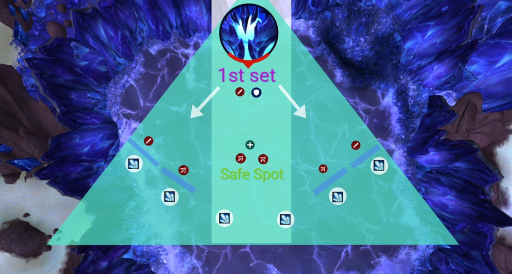
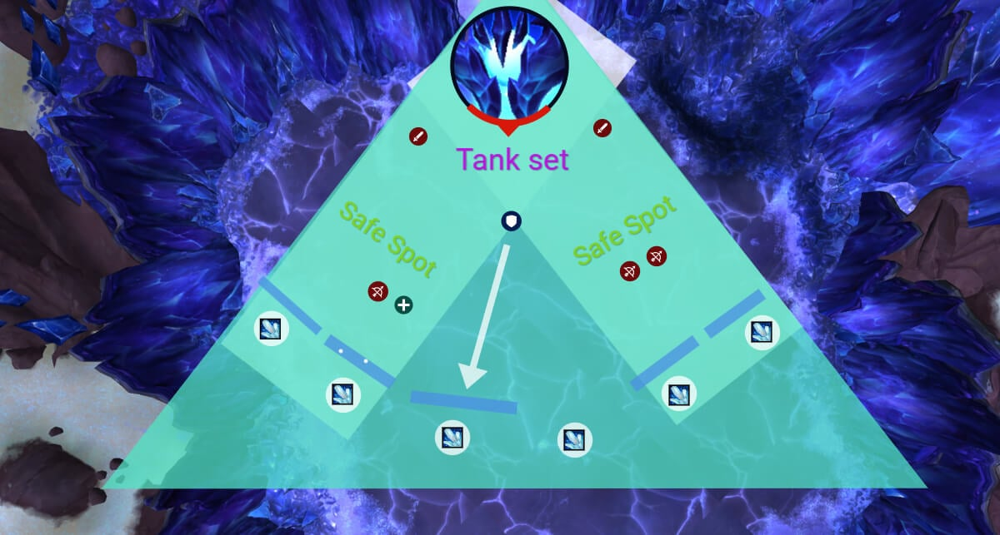
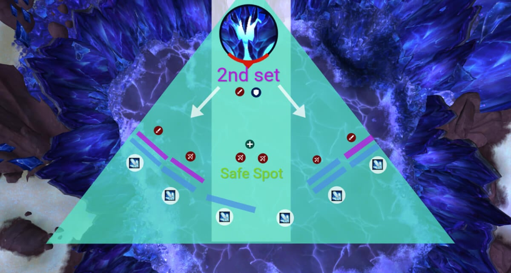
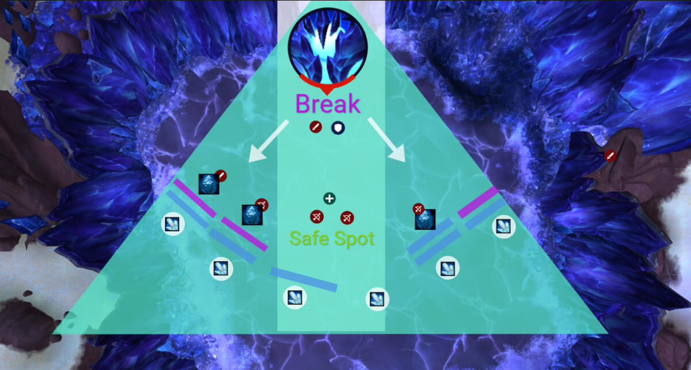
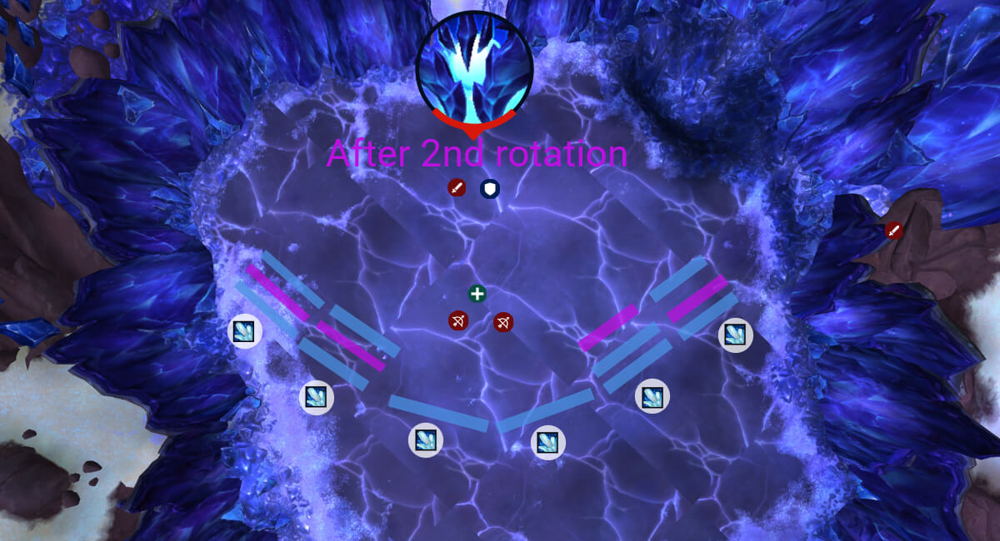
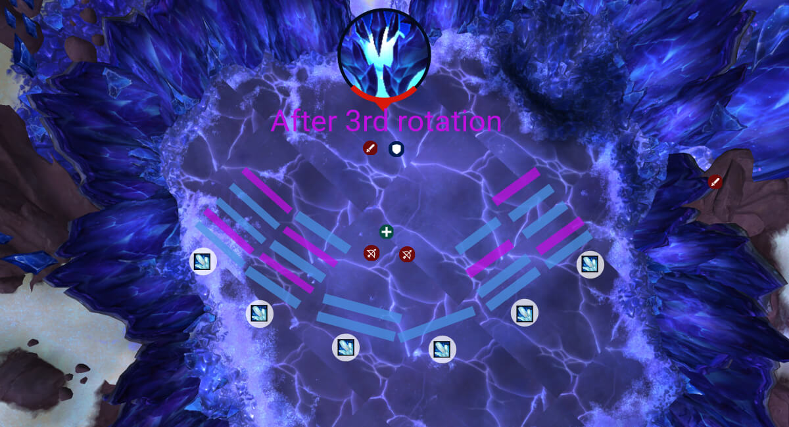

# Гайд на героического босса Фрактиллус

*Источник: Method, перевод с официальных русских названий способностей (Wowhead)*

## Упрощенный режим

Управление стенами — это весь бой. Не стакайте 6 стен на один штырь.

Поток фазы:

- Начните бой, сгруппировавшись в центре
- Первые 4 цели для стен: отправьте 2 влево и 2 вправо (по одной на штырь)
- Все остальные остаются в центре (в безопасности от пути стены)
- Танк кладет стену в центр , все выходят
- Второй сет стен: 2 влево и 2 вправо (избегайте стакания на том же штыре снова)
- Все остальные в центр
- [Раскалывающий удар наотмашь](https://www.wowhead.com/ru/spell=1220394) на 100 энергии:

Повторяйте ротацию:

- 4 игрока: стены по сторонам
- Танк: стена в центр
- Еще 4 игрока: стены по сторонам
- Сломайте 3 стены снова

Планирование энрейджа:

- Если вы не отслеживаете стаки стен, босс войдет в энрейдж
- Всегда ломайте хотя бы 1 стену за ротацию стороны
- После 2 полных циклов стороны близки к заполнению
- После 3 циклов, вы ДОЛЖНЫ начать размещать стены в центр

Дополнительные напоминания:

- Стена пустоты: разойдитесь с [Нуль-поглощение](https://www.wowhead.com/ru/spell=1247424) .
- Ломка стен: избегайте кружочков.
- Не попадите под чужую стену. Просто нет.
- Раскатистый удар : танковый бастер. Меняйтесь и не кладите в заставленный проход.
- [Преломление энтропии](https://www.wowhead.com/ru/spell=1241137) растет с каждой живой стеной. Не оставляйте лишние слишком долго.

## Тактика

Этот бой по сути кристальный Тетрис, и вы — человек, пытающийся правильно разместить блоки. Весь бой вращается вокруг управления размещением стен и не попадания под стены, которые были не нацелены на вас.

#### Управление стенами 101

В комнате есть шесть предварительно размещенных кристальных штырей ( [Призма Пустоты](https://www.wowhead.com/ru/spell=1233657) ), и когда босс нацеливается на игрока Кристаллической ударной волной, стена запустится к нему и автоматически присоединится к ближайшему штырю на своем пути.

Так в чем подвох? Если шесть стен сложатся на одном штыре, босс входит в энрейдж, и придется начинать заново.

#### Поток боя и тактика

Начните бой со всеми, сгруппированными в центре. Первая волна пометит 4 игроков Энтропическая конъюнкция , это ваши первые цели для стен.

Отправьте 2 влево и 2 вправо. Убедитесь, что на каждый штырь идет одна стена. Никто не должен быть рядом с траекторией, кроме этих 4 игроков, так что все остальные должны быть в центре.

Как только стены упадут, все выходят из центра, чтобы танк мог кинуть свою стену прямо в центр.

Теперь размещено 5 стен: 4 по сторонам и 1 в центре.

Сразу после, еще 4 игрока получают дебаффы стен, причем 3 из них — стены [Нексус энергии Бездны](https://www.wowhead.com/ru/spell=1236785).

Та же идея для этого сета: разделите 2 влево и 2 вправо, избегайте удвоения на предыдущих штырях, когда возможно.

Все остальные должны вернуться в центр для безопасности, пока команда со стенами управляет размещением.

На 100 энергии происходит [Раскалывающий удар наотмашь](https://www.wowhead.com/ru/spell=1220394). 3 игрока получают [Смертоносная корка](https://www.wowhead.com/ru/spell=1227373) , и когда обездвижены ( [Кристаллическая оболочка](https://www.wowhead.com/ru/spell=1227378) ), они будут запущены назад, так вы уничтожаете стены.

Каждый игрок должен стоять перед стеной (расстояние не имеет значения).

Ломайте стены на левых и правых штырях, отдавая приоритет штырям, которые начинают заставаться.

Старайтесь избегать ломки всех 3 стен пустоты за раз, это помогает сгладить будущие появления пустоты.

#### И повторяйте!

Как только удар снесет 3 стены, вы начинаете паттерн заново:

- 4 игрока идут влево и вправо с дебаффом стены
- Отдавайте приоритет штырям с наименьшим количеством стен на них
- Все остальные возвращаются в центр (безопасное место)
- Танковая стена идет в центр, все остальные отходят от центра
- Второй сет стен (снова влево и вправо), при этом центр — безопасное место для остального рейда
- Выполните ломку стен

#### Отслеживание стен и планирование энрейджа

После второй полный цикл , если вы сделали все чисто, ваши штыри могут выглядеть примерно так:

- ЛЕВО : 3 стены (1-й раунд) + 3 стены (2-й раунд) = 6 всего
- ПРАВО : 3 стены + 4 стены = 7 всего , НО если вы сломали 1 во время ломки стен, остается 6 макс

Убедитесь, что всегда ломайте одну с наибольшего стака , это то, что предотвращает энрейдж.

После третий цикл :

- ЛЕВО : 5 + 5 = 10 всего
- ПРАВО : 4 + 5 = 9 всего

На этом этапе вы ДОЛЖНЫ иметь 1 игрок ломает за высокостаковую(5) стену (цельтесь сломать обе стороны каждый раз).

После этого вы полностью заполнили ваши боковые штыри , теперь вы должны начать размещать их на центральных штырях , пока танк размещает по сторонам. Это становится вашей гонкой против энрейджа , до того как 6-я стена сможет там приземлиться.

#### Другие вещи, от которых не умереть

- [Нуль-поглощение](https://www.wowhead.com/ru/spell=1247424) (взрывы стен пустоты): Разойдитесь, когда получите
- Взрывы Кристалл-источника: Сломали стену? Не стойте в кружочках, которые она оставляет.
- [Кристаллическая ударная волна](https://www.wowhead.com/ru/spell=1224414) : Только целевой игрок должен быть на пути стены. Все остальные — в безопасных местах.
- Раскатистый удар : Танковый бастер, смена танка и никогда не класть в заставленный штырями проход.
- [Преломление энтропии](https://www.wowhead.com/ru/spell=1241137) : Чем больше стен живо, тем больше рейдовый урон. Не будьте жадными на ломке стен.