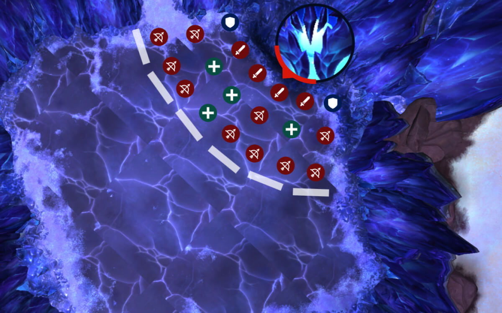

# Гайд на мифического босса Фрактиллус

*Источник: Method, перевод с официальных русских названий способностей (Wowhead)*

## Упрощенный режим

- У всех есть круги во время спреда, заранее назначьте статические позиции.
- Маленькие круги больнее, избегайте их; перекрывайтесь только с большими кругами под дефенсивами.
- Следите за [Раскалывающий удар наотмашь](https://www.wowhead.com/ru/spell=1220394) ломкой стен, жмите рейдовые дефенсивы по отмеченным таймерам.
- Следуйте вашей WeakAura, правильно спредьтесь и используйте дефенсивы.

## Механики

*(Нажмите на название способности, чтобы увидеть подробности)*

## Тактика

К сожалению, один из самых разрекламированных боссов тира оказался огромным разочарованием, в основном благодаря масштабным нерфам сразу после релиза. Хорошая новость в том, что этот бой чрезвычайно простой, и с правильной WeakAura вы по сути закончите еще до пула.

Для WeakAura мы рекомендуем использовать пакет Northern Sky: https://wago.io/NSManaforge

Следуйте инструкциям там и просто выполняйте назначения WeakAura! Куда бы вам ни сказали идти — идите! Если все это сделают, босс умрет.

Главная механика, о которой стоит беспокоиться — спред. В Мифике каждый игрок получает круг во время проверки спреда, так что единственный способ постоянно справляться с ней — заранее назначить статические позиции для всего рейда. Думайте об этом как о танцполе, где у каждого свой квадрат, и вы просто идете туда каждый раз. Это избегает перекрытий и делает механику очень простой после настройки.

Одна вещь, которую стоит помнить: маленькие круги на самом деле больнее, чем большие; если у вас есть возможность двигаться, избегайте стояния внутри маленького круга любой ценой. Если вы все же перекрываетесь с кем-то, у кого большой круг, используйте дефенсив, чтобы выжить, это не убьет вас, но больно ударит.

Второй уровень сложности — просто быть готовым к более сложным моментам боя. Это [Раскалывающий удар наотмашь](https://www.wowhead.com/ru/spell=1220394) , которые в Мифике являются ядерками ломки стен, бьющими всех сразу. Если не спланировать заранее, вас застанут врасплох.

Вот простая MRT заметка, которую можно скопировать прямо в ваши таймеры, чтобы никто не забыл, когда жать дефенсивы:

И это весь бой. Следуйте вашей WeakAura, придерживайтесь ваших спред-позиций, и жмите дефенсивы по указанным выше таймерам. Если вы это сделаете, Фрактиллус падает без особого сопротивления.