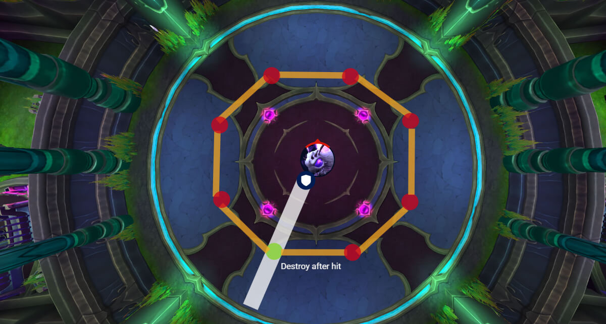
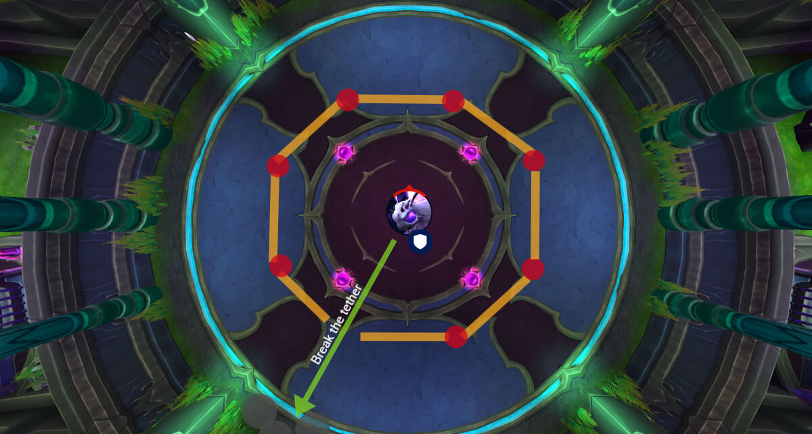
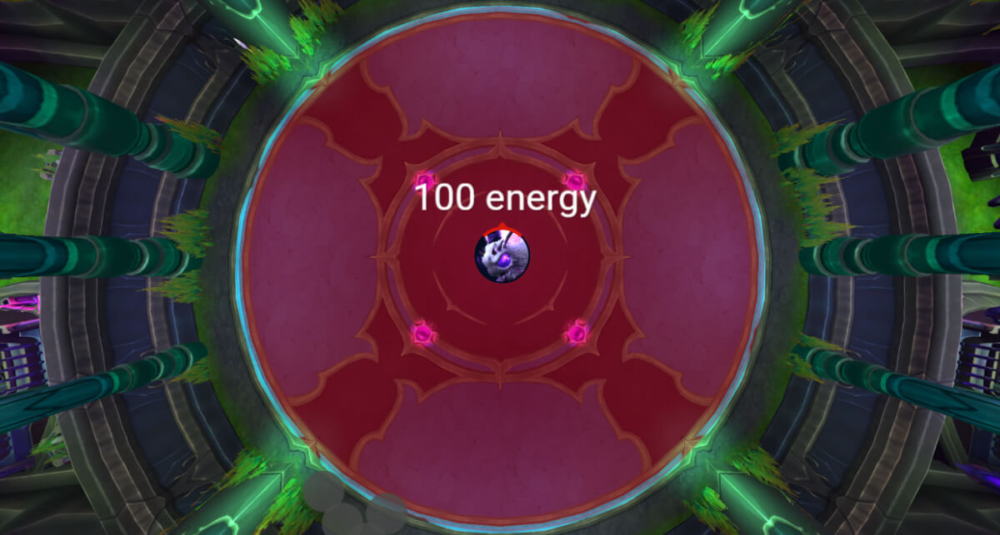
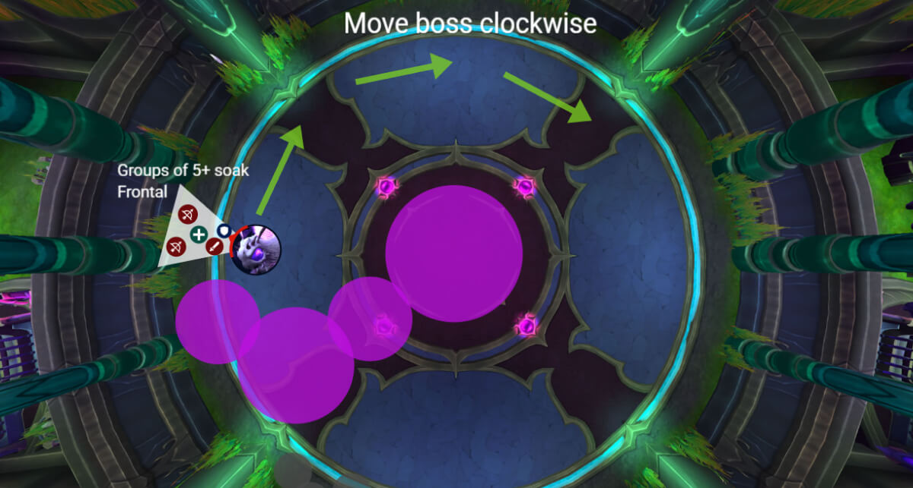

# Гайд на героического босса Лум'итар

*Источник: Method, перевод с официальных русских названий способностей (Wowhead)*

## Упрощенный режим

**Фаза 1:**

- **Танк направляет [Пронзающая нить](https://www.wowhead.com/ru/spell=1227263)** through [Сплетенный оберег](https://www.wowhead.com/ru/spell=1238502) чтобы сделать его уязвимым
- **Разрушьте барьер** чтобы создать разрыв в сжимающемся шелковом кольце
- **Игроки с [Насыщающие путы](https://www.wowhead.com/ru/spell=1226315)** должны:
- **Не стойте в [Живой шелк](https://www.wowhead.com/ru/spell=1226366) лужи** (они оглушают и сильно бьют)
- При 100 энергии: **бегите к краю** чтобы избежать [Взрыв от перенасыщения](https://www.wowhead.com/ru/spell=1226395)

**Фаза 2 (55% HP):**

- Босс становится мобильным, **кайтите ее по часовой стрелке** вдоль внешней стены
- **Не стойте в фиолетовых [Чародейский ихор](https://www.wowhead.com/ru/spell=1243771) лужи**
- **Чередуйте группы поглощения** for [Извивающаяся волна](https://www.wowhead.com/ru/spell=1227226) (5+ игроков за волну)
- Use **Героизм/Кровожадность** и сжигайте босса до того, как комната заполнится или рейд рухнет от мягкого энрейджа
- **Используйте кулдауны** on [Извивающаяся волна](https://www.wowhead.com/ru/spell=1227226) + [Чародейское возмущение](https://www.wowhead.com/ru/spell=1227782) перекрывается

## Механики

*(Нажмите на название способности, чтобы увидеть подробности)*

#### Плетение кокона

Лум’итар создает сжимающееся кольцо из чародейского шелка, которое обездвиживает попавших игроков на 8 секунд.

- Попадание наносит умеренный урон от сил природы и обездвиживает вас.
- Кольцо исчезает по мере уничтожения Насыщенных клубков.

#### Сплетенный оберег

В героическом режиме каждый Насыщенный клубок защищен барьером, который предотвращает весь урон.

Единственный способ разрушить щит — ударить его [Пронзающая нить](https://www.wowhead.com/ru/spell=1227263).

#### Пронзающая нить

Танковая механика, которая выпускает массивную чародейскую линию через текущего танка.

- Поражает всех игроков на пути огромным уроном и накладывает 1000% уязвимость.
- Должно быть поглощено в соло и требует немедленной смены танка.

#### Насыщающие путы

Несколько игроков втягиваются к боссу и связываются шелковыми нитями, которые со временем наносят все больший урон от тайной магии.

- Отбег на 40 метров разрывает связь и оставляет лужу [Живой шелк](https://www.wowhead.com/ru/spell=1226366).
- Стояние в [Живой шелк](https://www.wowhead.com/ru/spell=1226366) когда связь закончится, оглушит игрока [Шелковые силки](https://www.wowhead.com/ru/spell=1226721).

#### Живой шелк

Лужи, оставленные после разрыва связей. Наносят периодический урон от сил природы и замедляют передвижение на 25%.

#### Взрыв от перенасыщения

Наносит сильный урон по всему рейду в течение 8 секунд, затем заканчивается массивным взрывом. Взрыв поражает всех игроков в радиусе 45 метров.

#### Изначальная чародейская буря

Маленькие спиральки падают случайно сверху. Стояние в них наносит умеренный урон от тайной магии.

#### Чародейское переполнение

Пульсирующее АоЕ, бьющее по всему рейду на протяжении всего боя. Увеличивается в частоте и интенсивности во Фазе 2.

#### Выброс шелка

Обычные удары босса в ближнем бою наносят физический урон текущей цели.

#### Необузданная ярость

Когда начинается Фаза 2, Лум’итар обрушивается вниз и отбрасывает всех.

Также увеличивает получаемый боссом урон на 33% на остаток боя**.**

#### Чародейский ихор

Огромная лужа появляется под боссом и расползается наружу.

#### Чародейское возмущение

4-секундный канал отбрасывания, бьющий весь рейд каждую секунду.

#### Извивающаяся волна

Передний конус, разделенный между игроками.

- Наносит огромный урон от сил природы, затем периодический урон на 25 секунд.
- Должно быть поглощено как минимум 5 игроками.
- Попавший получает на 350% больше урона от следующей [Извивающаяся волна](https://www.wowhead.com/ru/spell=1227226).
- Разделите рейд на 2 группы для этого и чередуйтесь каждый раз.

## Тактика

Босс остается запертым в середине комнаты всю фазу, и ваша единственная задача — правильно выполнять две механики.

[Плетение кокона](https://www.wowhead.com/ru/spell=1237272) — это большое **кольцо из шелка** которое медленно сжимается вокруг босса. Попадание под него обездвиживает вас и наносит большой урон от сил природы.

You can **создайте разрыв** в кольце, разрушив [Сплетенный оберег](https://www.wowhead.com/ru/spell=1238502), но она защищена.

The **танк** нужно **направить [Пронзающая нить](https://www.wowhead.com/ru/spell=1227263)** через барьер, чтобы разрушить его щит и сделать уязвимым.

Once it's attackable, **сжигайте ее быстро** чтобы создать безопасный проход и выбежать.

Несколько игроков получают связь ([Насыщающие путы](https://www.wowhead.com/ru/spell=1226315)) к боссу и медленно втягиваются. Урон **увеличивается со временем**, и когда связь разрывается, вы оставляете лужу.

If you're **все еще в луже**, вы оглушаетесь и умираете от периодического урона.

Идеальные игроки (с телепортами/рывками) должны разрывать связь пораньше, чтобы снизить нагрузку на хилеров. Все остальные: **дождитесь [Сплетенный оберег](https://www.wowhead.com/ru/spell=1238502) разрыв**, затем выбегайте и разрывайте связь.

Loom'ithar casts [Взрыв от перенасыщения](https://www.wowhead.com/ru/spell=1226395), a **гигантский взрыв**, покрывающая большую часть арены. Бегите к краям, чтобы избежать ее.

Становится сложно, если слишком много луж возле стен, поэтому размещайте лужи с предвидением.

Это все Фаза 1. Кольцо приходит, вы разрушаете барьер, игроки разрывают связи, босс взрывается, вы выбегаете, повторяйте, пока Лум'итар не достигнет 55% здоровья.

### Фаза 1

Босс остается запертым в середине комнаты всю фазу, и ваша единственная задача — правильно выполнять две механики.

#### Плетение кокона и Пронзающая нить

[Плетение кокона](https://www.wowhead.com/ru/spell=1237272) — это большое **кольцо из шелка** которое медленно сжимается вокруг босса. Попадание под него обездвиживает вас и наносит большой урон от сил природы.

You can **создайте разрыв** в кольце, разрушив [Сплетенный оберег](https://www.wowhead.com/ru/spell=1238502), но она защищена.

The **танк** нужно **направить [Пронзающая нить](https://www.wowhead.com/ru/spell=1227263)** через барьер, чтобы разрушить его щит и сделать уязвимым.

Once it's attackable, **сжигайте ее быстро** чтобы создать безопасный проход и выбежать.

#### Насыщающие путы

Несколько игроков получают связь ([Насыщающие путы](https://www.wowhead.com/ru/spell=1226315)) к боссу и медленно втягиваются. Урон **увеличивается со временем**, и когда связь разрывается, вы оставляете лужу.

If you're **все еще в луже**, вы оглушаетесь и умираете от периодического урона.

Идеальные игроки (с телепортами/рывками) должны разрывать связь пораньше, чтобы снизить нагрузку на хилеров. Все остальные: **дождитесь [Сплетенный оберег](https://www.wowhead.com/ru/spell=1238502) разрыв**, затем выбегайте и разрывайте связь.

#### Взрыв от перенасыщения при 100 энергии

Loom'ithar casts [Взрыв от перенасыщения](https://www.wowhead.com/ru/spell=1226395), a **гигантский взрыв**, покрывающая большую часть арены. Бегите к краям, чтобы избежать ее.

Становится сложно, если слишком много луж возле стен, поэтому размещайте лужи с предвидением.

Это все Фаза 1. Кольцо приходит, вы разрушаете барьер, игроки разрывают связи, босс взрывается, вы выбегаете, повторяйте, пока Лум'итар не достигнет 55% здоровья.

### Фаза 2

При 55% Лум’итар освобождается, разбивает землю уроном по всему рейду и становится полностью мобильной. Тут-то и начинается настоящий бой.

С этого момента босс постоянно сбрасывает [Чародейский ихор](https://www.wowhead.com/ru/spell=1243771); массивные фиолетовые лужи, которые остаются и наносят огромный урон всем, кто стоит в них. Чтобы управлять пространством, двигайте босса к краю комнаты и кайтите ее медленно по часовой стрелке, пока пол не заполнится.

Тем временем она применяет [Извивающаяся волна](https://www.wowhead.com/ru/spell=1227226), массивный передний конус, который должен быть поглощен как минимум пятью игроками. Попавший под него получает сильный периодический урон на 25 секунд и получает на 350% больше урона от следующей волны. Если меньше пяти человек поглощают, босс вместо этого щитует себя.

Это значит, что вам понадобятся назначенные группы поглощения, чередующиеся каждым применением, здесь нельзя импровизировать, иначе вайп.

Чем дольше длится эта фаза, тем больше урона наносит босс. [Чародейское возмущение](https://www.wowhead.com/ru/spell=1227782) пульсирует через рейд и начинает быстро накапливаться. В конце концов комната становится почти непригодной из-за луж и случайных спиралек чародейской бури.

This is your **фаза сжигания**, используйте здесь Героизм/Кровожадность и сбрасывайте все кулдауны, чтобы убить босса до того, как комната убьет вас.