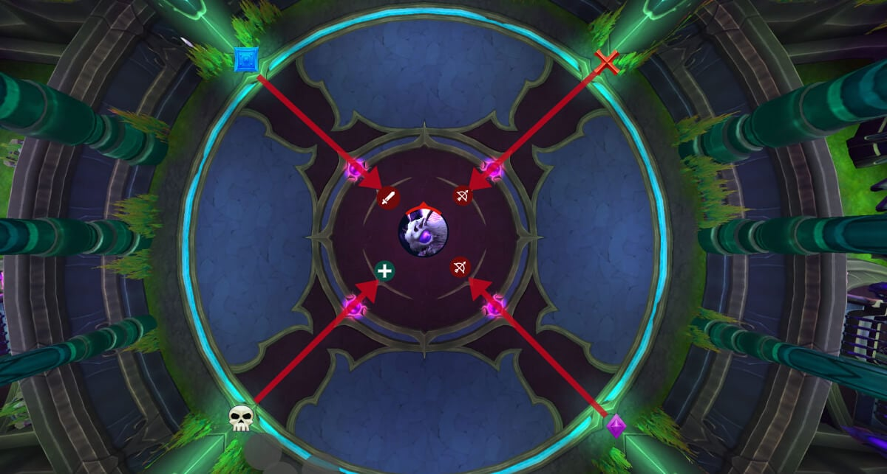
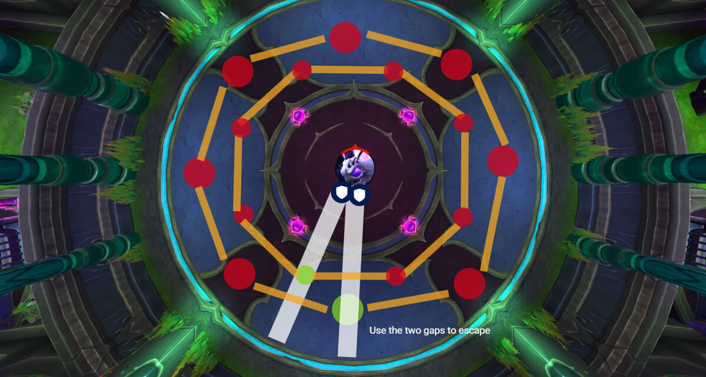
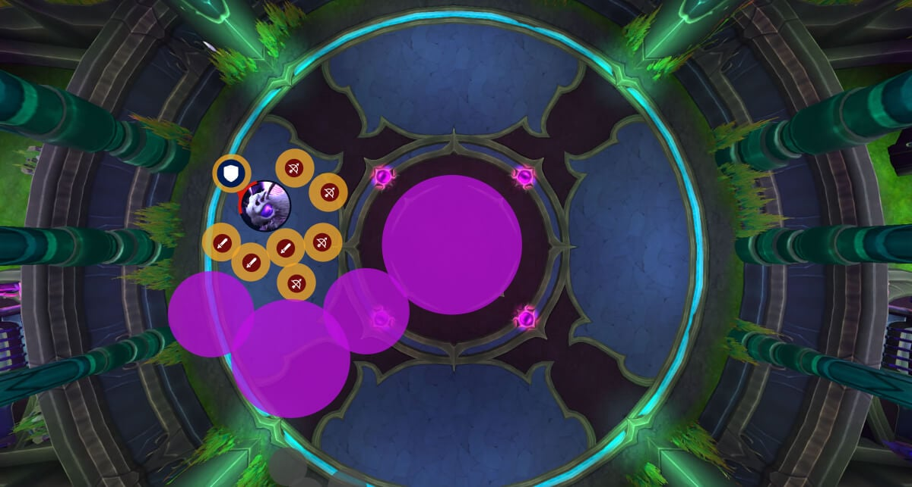

# Гайд на мифического босса Лум'итар

*Источник: Method, перевод с официальных русских названий способностей (Wowhead)*

## Упрощенный режим

**Фаза 1:**

- Чародейские пилоны появляются со временем
- [Плетение кокона](https://www.wowhead.com/ru/spell=1237272) теперь имеет **два** сжимающихся кольца
- [Насыщающие путы](https://www.wowhead.com/ru/spell=1226315) разрыв

**Фаза 2:**

- Сохраните **Героизм / Кровожадность** и кулдауны ДПС
- [Чародейское возмущение](https://www.wowhead.com/ru/spell=1227782)
- [Извивающаяся волна](https://www.wowhead.com/ru/spell=1227226)

## Тактика

Этот бой в основном проходит так же, как в героическом режиме, но мифик вносит несколько ключевых изменений, которые повышают требования к координации и сильнее наказывают за малейшие ошибки.

### Фаза 1

Первое большое изменение — добавление Чародейских пилонов вокруг комнаты.

Они активируются постепенно, начиная с одного пилона и в конце концов все четыре становятся активными до начала Фазы 2. Если луч пилона не перехвачен игроком, он направится в босса.

Один пилон не опасен, но урон существенно возрастает с каждым дополнительным лучом. Если все четыре направляют энергию одновременно, рейд быстро будет перегружен.

Для перехвата игроки встают в луч, который накладывает накапливающийся периодический урон ([Гипернасыщение](https://www.wowhead.com/ru/spell=1247045)). Этот периодический урон начинает больно бить примерно при **5-7 стаков**, поэтому игроки должны меняться до достижения этой точки. Дебафф спадает через 45 секунд.

Команда из двух игроков на пилон достаточна для безопасного выполнения механики. Однако вам нужно назначить две группы по 2 игрока на каждый маркер пилона из-за случайности их активации. Если тот же пилон активируется дважды подряд, предыдущие два игрока, которые поглощали, все еще будут с дебаффом. Здесь вступает в дело вторая группа.

Пример группы пилона:

- Игрок 1 и Игрок 2
- Игрок 3 и Игрок 4

И так далее для каждого маркера.

Второе изменение в том, что каждый [Плетение кокона](https://www.wowhead.com/ru/spell=1237272) теперь состоит из двух сжимающихся колец вместо одного.

Каждое кольцо содержит [Сплетенный оберег](https://www.wowhead.com/ru/spell=1238502) которые должны быть уничтожены, чтобы пройти. В мифическом режиме один барьер должен быть уничтожен на внутреннем, а один — на внешнем кольце. Эти барьеры неуязвимы к урону, пока не будут ударены [Пронзающая нить](https://www.wowhead.com/ru/spell=1227263), как и в героическом режиме.

Это просто означает, что оба танка должны ударить барьер, так как оба танка получают [Пронзающая нить](https://www.wowhead.com/ru/spell=1227263) на них (один за другим).

Также есть дополнительный риск с [Насыщающие путы](https://www.wowhead.com/ru/spell=1226315) в мифике. Когда связь разрывается, она наносит дополнительный всплеск урона связанному игроку. Хилеры должны убедиться, что у этих игроков полное здоровье, прежде чем они разорвут связь.

### Фаза 2

Очень важно сохранить Героизм / Кровожадность для этой фазы и иметь готовыми кулдауны ДПС.

Хилеры также должны убедиться, что самые большие нарастания готовы для каждой [Чародейское возмущение](https://www.wowhead.com/ru/spell=1227782).

[Чародейское возмущение](https://www.wowhead.com/ru/spell=1227782) по-прежнему наносит высокий урон по всему рейду сама по себе, но в мифике, когда канал заканчивается, каждый игрок взрывается небольшим взрывом, который бьет союзников в радиусе шести метров.

Когда применение заканчивается, весь рейд должен немедленно разойтись, чтобы избежать перекрывающегося урона.

[Извивающаяся волна](https://www.wowhead.com/ru/spell=1227226) по-прежнему требует группового поглощения.

Если меньше пяти игроков попало под начальный удар, босс получает Смертную узду. Это накапливающийся абсорб-щит, который может существенно замедлить убийство. Даже если у игроков мало здоровья, достаточное количество поглощающих должно быть на позиции, чтобы не дать боссу бафф.

Бой, как и в героическом, повторяется, пока босс не побежден (или вы).

Поглощайте фронталку, разойдитесь для кругов, двигайте босса по часовой стрелке, чтобы не стоять в лужах.

Получаемый урон возрастает по ходу боя, поэтому вы действительно хотите убить босса как можно скорее на этой фазе.