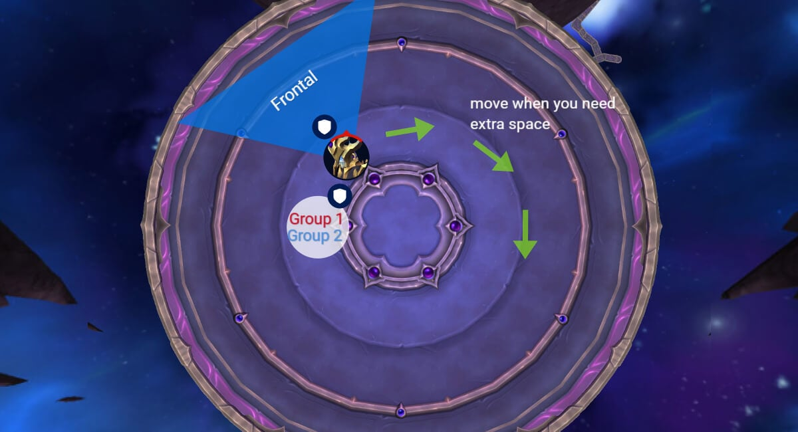
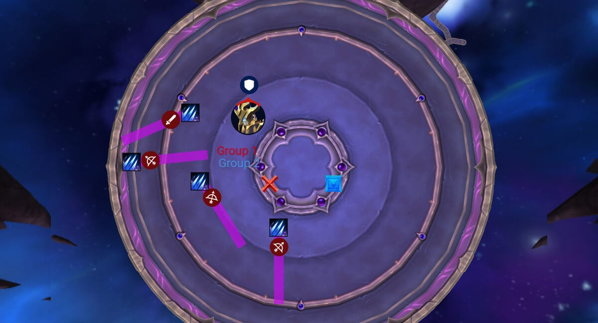
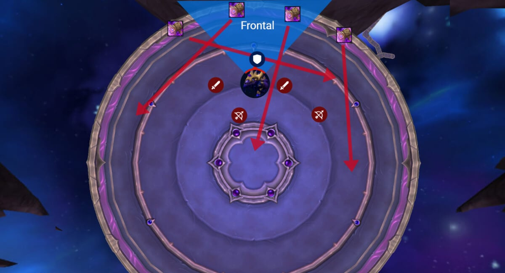
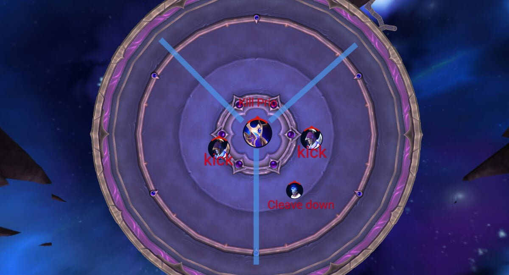
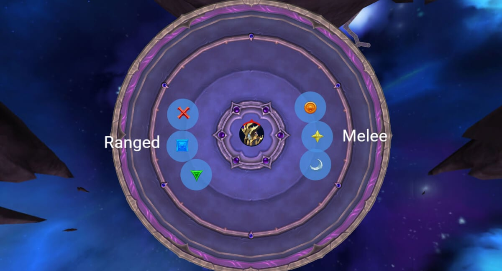
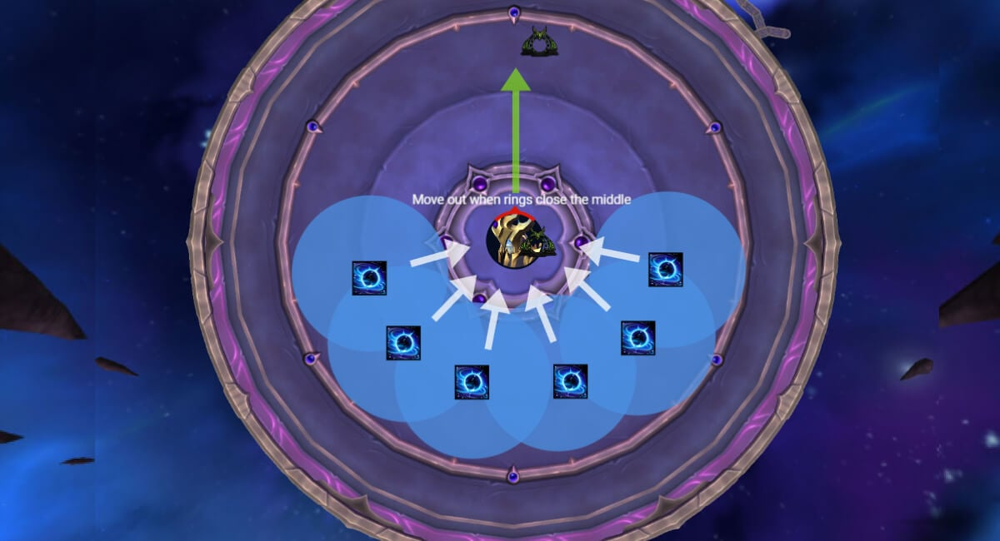
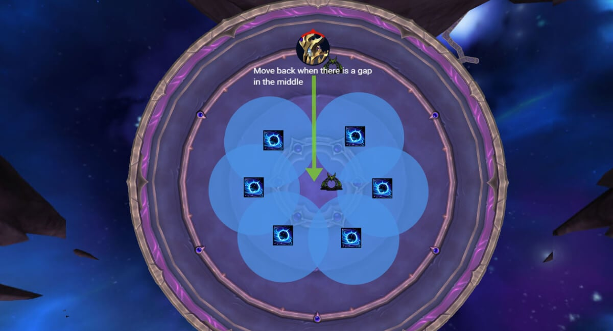
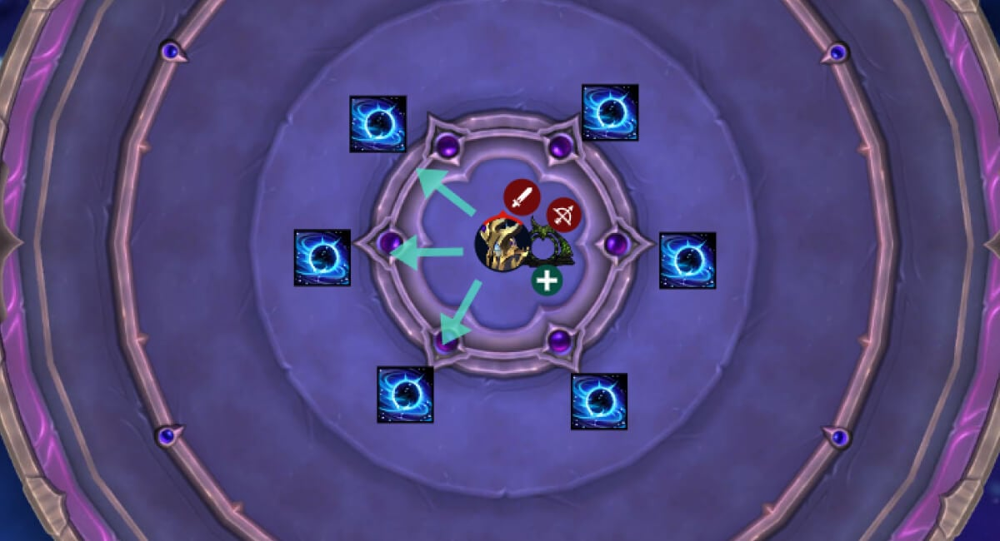
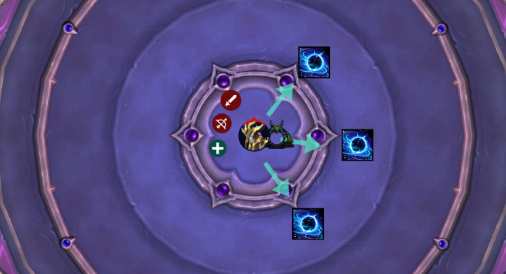

# Гайд на героического босса Король узла Салхадаар

*Источник: Method, перевод с официальных русских названий способностей (Wowhead)*

## Упрощенный режим

**Ф1 — Управление клятвой и танковые комбо:**

- Все начинают с **3 стака Клятвенной связи**; необходимо снять все до [Призыв клятвы](https://www.wowhead.com/ru/spell=1224906) после 3 танковых комбо.
- [Покорение](https://www.wowhead.com/ru/spell=1224787): танк сосет со своей группой, чтобы снять стаки. Чередовать группы каждое применение.
- [Уничтожение](https://www.wowhead.com/ru/spell=1224812): фронтальный удар, развернуть от рейда.
- Танки провоцируют во время применения следующей способности.
- [Обезглавливание](https://www.wowhead.com/ru/spell=1224827) линии: выбранные игроки отходят, не задевайте других.
- Смерть равна подчинению разуму ([Раб короля](https://www.wowhead.com/ru/spell=1224767)), взрыв рейда при смерти.

**Ф2 — Фаза верховой езды на драконе:**

- 4x **Пространственные порталы** разместите их далеко друг от друга.
- [Дыхание измерения](https://www.wowhead.com/ru/spell=1228163) на танке + порталы стреляют лучами в случайных направлениях, уклоняйтесь.
- Урон рейду от **Блик** в зависимости от урона дыхания танка.
- Меняйте танков после [Космическая пасть](https://www.wowhead.com/ru/spell=1234529).
- Повторяйте, пока босс не наберет 100 энергии.

**Перерыв 1 — Разделение сторон:**

- Разделитесь на те же группы Фазы 1 и используйте порталы на каждую сторону.
- **Приоритет убийства**: Титан из маныков > Жнецы > Все остальное
- Уклоняйтесь от лучей Принцев, прерывайте [Взрыв Пустоты](https://www.wowhead.com/ru/spell=1230261).

**Перерыв 2 — Сожжение дракона:**

- Босс высасывает дракона в течение 30 сек., дракон получает +100% урона.
- Используйте героизм / жажду крови и кулдауны здесь.
- Салхадаар исцеляется на оставшееся здоровье дракона.

**Ф3 — [Темная звезда](https://www.wowhead.com/ru/spell=1248137) Контроль:**

- [Галактический удар](https://www.wowhead.com/ru/spell=1226648): 6 игроков размещают звезды на отмеченных позициях, чтобы отменить притяжение.
- [Взмах звездоубийцы](https://www.wowhead.com/ru/spell=1226347): 3 луча направляют каждый снаряд в другую звезду, чтобы уничтожить ее.
- Уклоняйтесь от звездных колец (в стиле Шелкового суда).
- Никогда не ставьте звезды так близко, чтобы один снаряд попал в две.
- Шаблон: 2x [Взмах звездоубийцы](https://www.wowhead.com/ru/spell=1226347), [Галактический удар](https://www.wowhead.com/ru/spell=1226648), затем повторяйте, пока босс не умрет.

## Тактика

В самом начале, **весь рейд получает 3 стака [Клятвенная связь](https://www.wowhead.com/ru/spell=1224737)**. Ваша главная задача на этой фазе — снять все три стака до того, как босс применит [Призыв клятвы](https://www.wowhead.com/ru/spell=1224906), которая происходит после **трех полных наборов танковых комбо**.

**Смерть особенно карается** здесь любой игрок, который умирает, становится подконтрольным разуму с полным здоровьем, его нужно убить, он взрывается, нанося тяжелый урон рейду, и только тогда его можно воскресить.

**Позиционирование:** Держите босса близко к центру комнаты. Разделите рейд на две группы, чтобы позже разделиться для перерыва, и чередовать группы, сосущие [Покорение](https://www.wowhead.com/ru/spell=1224787). Вы можете использовать ту же точку, чтобы сосать ее, просто убедитесь, что правильная группа ее сосет. Есть достаточно времени, чтобы скорректировать.

**Танковое комбо** не имеет фиксированного порядка. Активный танк должен реагировать на лету:

После каждого танкового комбо несколько игроков будут выбраны целью способностью [Обезглавливание](https://www.wowhead.com/ru/spell=1224827). Им нужно быстро отойти и опустить линию подальше от группы. Те, кто не является целью, должны избегать попадания под нее.

Танки также должны отводить босса от этих линий, чтобы создать больше пространства, так как [Обезглавливание](https://www.wowhead.com/ru/spell=1224827) оставляет за собой лужи урона, которые ограничат безопасное позиционирование.

Эта последовательность повторяется, пока не будут завершены три серии танковых комбо, после чего босс применяет [Призыв клятвы](https://www.wowhead.com/ru/spell=1224906). Любой, у кого еще остались стаки, становится подконтрольным [Раб короля](https://www.wowhead.com/ru/spell=1224767).

### Фаза 1

В самом начале, **весь рейд получает 3 стака [Клятвенная связь](https://www.wowhead.com/ru/spell=1224737)**. Ваша главная задача на этой фазе — снять все три стака до того, как босс применит [Призыв клятвы](https://www.wowhead.com/ru/spell=1224906), которая происходит после **трех полных наборов танковых комбо**.

**Смерть особенно карается** здесь любой игрок, который умирает, становится подконтрольным разуму с полным здоровьем, его нужно убить, он взрывается, нанося тяжелый урон рейду, и только тогда его можно воскресить.

**Позиционирование:** Держите босса близко к центру комнаты. Разделите рейд на две группы, чтобы позже разделиться для перерыва, и чередовать группы, сосущие [Покорение](https://www.wowhead.com/ru/spell=1224787). Вы можете использовать ту же точку, чтобы сосать ее, просто убедитесь, что правильная группа ее сосет. Есть достаточно времени, чтобы скорректировать.

**Танковое комбо** не имеет фиксированного порядка. Активный танк должен реагировать на лету:

- **[Уничтожение](https://www.wowhead.com/ru/spell=1224812):** Развернитесь от рейда, чтобы не зацепить их ударом.
- **[Покорение](https://www.wowhead.com/ru/spell=1224787):** Бегите к назначенной группе сосания.
- Всегда **провоцируйте во время применения** следующей способности, босс не сменит цель во время каста.

После каждого танкового комбо несколько игроков будут выбраны целью способностью [Обезглавливание](https://www.wowhead.com/ru/spell=1224827). Им нужно быстро отойти и опустить линию подальше от группы. Те, кто не является целью, должны избегать попадания под нее.

Танки также должны отводить босса от этих линий, чтобы создать больше пространства, так как [Обезглавливание](https://www.wowhead.com/ru/spell=1224827) оставляет за собой лужи урона, которые ограничат безопасное позиционирование.

Эта последовательность повторяется, пока не будут завершены три серии танковых комбо, после чего босс применяет [Призыв клятвы](https://www.wowhead.com/ru/spell=1224906). Любой, у кого еще остались стаки, становится подконтрольным [Раб короля](https://www.wowhead.com/ru/spell=1224767).

### Фаза 2

Король узла садится на Королевского Безднокрыла. Немедленно четверо игроков получают метки кругами, которые создают Пространственные порталы после короткой задержки. Разместите их у края комнаты, близко друг к другу, но не перекрывая. Подведите босса к этому месту и разверните его лицом к порталам для предстоящего дыхания.

Затем дракон применяет [Дыхание измерения](https://www.wowhead.com/ru/spell=1228163) на танке. Одновременно каждый портал выпускает свое дыхание в случайном направлении. Уклоняйтесь от этих лучей, получаемый рейдом урон зависит от того, сколько урона получил танк во время своего дыхания.

После лучей начнется Перерыв 1.

### Перерыв 1

Босс становится невосприимчивым. Порталы появляются слева и справа от арены; ваш рейд должен использовать те же группы Фазы 1, чтобы войти в каждый портал отдельно.

На каждой площадке / платформе:

- **Титаны маныков** являются вашим главным приоритетом убийства. Если они наберут полную энергию, они [Самоуничтожение](https://www.wowhead.com/ru/spell=1230302) и убьет группу. Он также применит 3 луча, вращающихся по часовой и против часовой стрелки, уклоняйтесь от них.
- **Жнецы стражи теней** наносят тяжелый урон случайным игрокам, но могут быть зачищены кливом.
- **Принц узла Ки’Вор и Ксеввос** стреляют лучами в нескольких направлениях, от которых нужно уклоняться. Оба применяют [Взрыв Пустоты](https://www.wowhead.com/ru/spell=1230261), который наносит огромный урон игроку, если не **Прервано**.

Как только вы вернетесь на основную платформу, у вас будет еще один набор [Дыхание измерения](https://www.wowhead.com/ru/spell=1228163) + Порталы, обрабатывайте их так же, как в первый раз.

Затем дракон переместится в центр, и начнется Перерыв 2.

### Перерыв 2

Босс все еще невосприимчив и поддерживает 30-секундное высасывание дракона, передавая любое оставшееся здоровье себе. Во время этого канала дракон получает **Урон увеличен на 100%**;** **здесь вы хотите использовать **Героизм / Жажда крови** и ваши лучшие кулдауны ДПС.

Вам придется уклоняться от линий вспышек во время этого, а также быть готовыми к сильному исцелению!

Через 30 секунд дракон поглощается и начинается Фаза 3.

### Фаза 3

Фаза начинается с [Галактический удар](https://www.wowhead.com/ru/spell=1226648), выбирая целью шесть игроков.

Каждый создает [Темная звезда](https://www.wowhead.com/ru/spell=1248137) при столкновении. Расставьте шесть заранее определенных меток по комнате, чтобы каждый игрок точно знал, куда бросать свою, это позиционирование нейтрализует эффект притяжения звезд.

Сначала ее получат 3 игрока дальнего боя, затем 3 игрока ближнего боя.

После того, как вы расставите звезды таким образом, появится естественный “выход”, когда круги начнут смыкаться к центру, как только станет тесно, отойдите от центра вместе с боссом. Когда кольца начнут расширяться, возвращайтесь назад, как только увидите безопасное отверстие.

Как только кольца накроют центр, они начнут расширяться и двигаться наружу, в этот момент появятся просветы к центру, которые вы можете использовать, чтобы вернуться назад. Всегда ждите «хлопка», чтобы начать возвращаться.

#### Взмах звездоубийцы

Три игрока становятся целью очень заметного **луч**. После короткой задержки лучи исходят в направлении, куда вы смотрите. Ваша задача здесь — **попасть в одну [Темную звезду](https://www.wowhead.com/ru/spell=1248137) каждым снарядом**. Это единственный способ уничтожить их.

Если два снаряда случайно попадут в одну [Темная звезда](https://www.wowhead.com/ru/spell=1248137), одна Темная звезда останется жива, и еще один набор Темных звезд должен будет выжить дольше, чем предполагалось, это быстро становится опасным.

Вам не нужно заходить за звезду, так как луч проходит сквозь игроков, но избегайте стоять в луче, если не являетесь его целью, так как он наносит тяжелый урон игроку, в которого попадает.

Еще хуже, если две [Темные звезды](https://www.wowhead.com/ru/spell=1248137) уничтожаются одновременно, например, один снаряд задевает две сразу, босс вызывает массивный взрыв по всему рейду, который может легко убить группу.

Безопасное выполнение:

- Призыв, который [Темная звезда](https://www.wowhead.com/ru/spell=1248137) вы получаете в момент, когда становитесь целью.
- Встаньте в линию с [Темная звезда](https://www.wowhead.com/ru/spell=1248137), убедившись, что на пути снаряда нет другой звезды.
- Чисто выпустите свой снаряд в звезду, остальные должны избегать попадания под него

После двух серий [Взмах звездоубийцы](https://www.wowhead.com/ru/spell=1226347), босс повторяет [Галактический удар](https://www.wowhead.com/ru/spell=1226648) и цикл продолжается до конца боя.