# Гайд на мифического босса Король узла Салхадаар

*Источник: Method, перевод с официальных русских названий способностей (Wowhead)*

## Упрощенный режим

**Подготовка и установка:**

- Используйте 3 лекаря (4 тоже подойдет, нет проверки ДПС).
- Разделите рейд на две равные группы платформ.
- Назначьте ротацию прерываний из 4 игроков (4-й = дальний бой).
- Ориентируйте метки по направлению взгляда босса перед пулом.

**Фаза 1 — Комбо, сосания и духи:**

- Приманивайте способности в центре; перегруппируйтесь перед каждым комбо из 4 способностей для предсказуемых лазеров дракона.
- **Рейдовые сосания:** Сосите только если это 1-е или 3-е в комбо. Пропущенные сосания требуют танковое сосание + иммунитет/защитные кулдауны.
- **Танковые сосания:** Всегда соло, Хмелевар/Воин лучше всего. При необходимости отправляйте иммунитеты.
- **Исцеление:** Чередуйте снижение урона и внешние кулдауны на 3 наборах сосания.
- **Когти:** Всего 10 (5 + 5). Бросайте их позади того места, где стоите. [Изгнание](https://www.wowhead.com/ru/spell=1227529) игроки заранее отходят.
- **Духи:** Ловите 1/2/3 духа за набор, поворачиваясь к ним. Пропуск одного = возвращение Клятвенной связи. Пропуск финального набора = смерть.

**Фаза 2 — Танец лазеров и платформы:**

- Круги появляются случайно, найдите безопасную зону после отбрасывания.
- **3-набор лазеров:**
- **Платформы:**

**Фаза сжигания — Короткое окно дракона:**

- Используйте кулдауны ДПС, убейте или сильно обожгите дракона.
- Распространитесь вокруг босса для линий и покрытия лекарей.
- Финальные когти: все направлены вперед, разойдитесь, чтобы не задевать друг друга.

**Фаза 3 — Звезды, кольца и звездоубийцы:**

- **Звезды:** 3 ближнего боя + 3 дальнего боя. Танк всегда в центре, остальные слева/справа. Сохраняйте промежутки.
- Игроки, размещающие звезды, используют сильные защитные кулдауны.
- После хвата: уклоняйтесь от колец (Набор 1 = двигайтесь после 3-го хлопка, Наборы 2 и 3 = после 4-го).
- **Звездоубийцы:** Ближайшие к иллюзиям игроки получают лазеры. Танк всегда стреляет в центральную звезду. При необходимости назначьте цели заранее.
- Повторяйте цикл звезды + кольцо + звездоубийца. Еще два набора до ~30 секунд мягкой ярости.
- Убейте босса до истечения таймера.

## Механики

*(Нажмите на название способности, чтобы увидеть подробности)*

#### Мстительная клятва

За каждый недостающий стак Клятвенной связи у игрока появится Дух и атакует его. Если игрок не повернется к духу, он вернет стак Клятвенной связи.

#### Дыхание измерения

Порталы и лазеры появляются в определенном шаблоне в мифическом режиме, см. раздел тактики для получения дополнительной информации.

#### Сумеречный барьер (Принц узла Ки'вор)

Принц узла Ки'вор защищает себя щитом на 50% от максимального здоровья. Заставляет игроков попадать по Принцу [Сумеречной резней](https://www.wowhead.com/ru/spell=1237107), чтобы более эффективно убрать щит.

#### Сумеречная резня (Жнец стражи теней)

Жнец стражи теней зафиксируется на игроке и через несколько секунд совершит рывок в его сторону.

Попадание по Принцу узла этой способностью нанесет урон поглощающему щиту.

Игроки, выбранные целью этой способности, должны убедиться, что их не задевает более одного Заряда жнеца.

#### Темная орбита

Размещенные звезды теперь вращаются вокруг платформы и должны быть размещены правильно, чтобы избежать столкновения и срабатывания [Столкновение звезд](https://www.wowhead.com/ru/spell=1226879) (см. раздел тактики).

#### Столкновение звезд (Ярость)

Если звезды перекроются или сдвинутся друг в друга, срабатывает жесткая ярость, приводящая к быстрому вайпу.

#### Коллапс узла (Ярость)

Попадание в одну звезду несколькими [Взмах звездоубийцы](https://www.wowhead.com/ru/spell=1226347) одновременно нанесут 30 миллионов урона всем игрокам, убивая большую часть рейда в процессе.

#### Мстительная клятва

За каждый недостающий стак Клятвенной связи у игрока появится Дух и атакует его. Если игрок не повернется к духу, он вернет стак Клятвенной связи.

#### Дыхание измерения

Порталы и лазеры появляются в определенном шаблоне в мифическом режиме, см. раздел тактики для получения дополнительной информации.

#### Сумеречный барьер (Принц узла Ки'вор)

Принц узла Ки'вор защищает себя щитом на 50% от максимального здоровья. Заставляет игроков попадать по Принцу [Сумеречной резней](https://www.wowhead.com/ru/spell=1237107), чтобы более эффективно убрать щит.

#### Сумеречная резня (Жнец стражи теней)

Жнец стражи теней зафиксируется на игроке и через несколько секунд совершит рывок в его сторону.

Попадание по Принцу узла этой способностью нанесет урон поглощающему щиту.

Игроки, выбранные целью этой способности, должны убедиться, что их не задевает более одного Заряда жнеца.

#### Темная орбита

Размещенные звезды теперь вращаются вокруг платформы и должны быть размещены правильно, чтобы избежать столкновения и срабатывания [Столкновение звезд](https://www.wowhead.com/ru/spell=1226879) (см. раздел тактики).

#### Столкновение звезд (Ярость)

Если звезды перекроются или сдвинутся друг в друга, срабатывает жесткая ярость, приводящая к быстрому вайпу.

#### Коллапс узла (Ярость)

Попадание в одну звезду несколькими [Взмах звездоубийцы](https://www.wowhead.com/ru/spell=1226347) одновременно нанесут 30 миллионов урона всем игрокам, убивая большую часть рейда в процессе.

#### Мстительная клятва

За каждый недостающий стак Клятвенной связи у игрока появится Дух и атакует его. Если игрок не повернется к духу, он вернет стак Клятвенной связи.

#### Дыхание измерения

Порталы и лазеры появляются в определенном шаблоне в мифическом режиме, см. раздел тактики для получения дополнительной информации.

#### Сумеречный барьер (Принц узла Ки'вор)

Принц узла Ки'вор защищает себя щитом на 50% от максимального здоровья. Заставляет игроков попадать по Принцу [Сумеречной резней](https://www.wowhead.com/ru/spell=1237107), чтобы более эффективно убрать щит.

#### Сумеречная резня (Жнец стражи теней)

Жнец стражи теней зафиксируется на игроке и через несколько секунд совершит рывок в его сторону.

Попадание по Принцу узла этой способностью нанесет урон поглощающему щиту.

Игроки, выбранные целью этой способности, должны убедиться, что их не задевает более одного Заряда жнеца.

#### Темная орбита

Размещенные звезды теперь вращаются вокруг платформы и должны быть размещены правильно, чтобы избежать столкновения и срабатывания [Столкновение звезд](https://www.wowhead.com/ru/spell=1226879) (см. раздел тактики).

#### Столкновение звезд (Ярость)

Если звезды перекроются или сдвинутся друг в друга, срабатывает жесткая ярость, приводящая к быстрому вайпу.

#### Коллапс узла (Ярость)

Попадание в одну звезду несколькими [Взмах звездоубийцы](https://www.wowhead.com/ru/spell=1226347) одновременно нанесут 30 миллионов урона всем игрокам, убивая большую часть рейда в процессе.

#### Мстительная клятва

За каждый недостающий стак Клятвенной связи у игрока появится Дух и атакует его. Если игрок не повернется к духу, он вернет стак Клятвенной связи.

#### Дыхание измерения

Порталы и лазеры появляются в определенном шаблоне в мифическом режиме, см. раздел тактики для получения дополнительной информации.

#### Сумеречный барьер (Принц узла Ки'вор)

Принц узла Ки'вор защищает себя щитом на 50% от максимального здоровья. Заставляет игроков попадать по Принцу [Сумеречной резней](https://www.wowhead.com/ru/spell=1237107), чтобы более эффективно убрать щит.

#### Сумеречная резня (Жнец стражи теней)

Жнец стражи теней зафиксируется на игроке и через несколько секунд совершит рывок в его сторону.

Попадание по Принцу узла этой способностью нанесет урон поглощающему щиту.

Игроки, выбранные целью этой способности, должны убедиться, что их не задевает более одного Заряда жнеца.

#### Темная орбита

Размещенные звезды теперь вращаются вокруг платформы и должны быть размещены правильно, чтобы избежать столкновения и срабатывания [Столкновение звезд](https://www.wowhead.com/ru/spell=1226879) (см. раздел тактики).

#### Столкновение звезд (Ярость)

Если звезды перекроются или сдвинутся друг в друга, срабатывает жесткая ярость, приводящая к быстрому вайпу.

#### Коллапс узла (Ярость)

Попадание в одну звезду несколькими [Взмах звездоубийцы](https://www.wowhead.com/ru/spell=1226347) одновременно нанесут 30 миллионов урона всем игрокам, убивая большую часть рейда в процессе.

## Тактика

Этот бой значительно сложнее по сравнению с предыдущими шестью боссами в подземелье.

Рекомендуется использовать трех лекарей, так как входящий урон управляем, но из-за текущих уровней предметов и известности взятие четырех лекарей не усложнит бой, так как в любой фазе нет строгих проверок ДПС.

Перед началом разделите рейд на две равные группы для платформ, как в героическом режиме.

Если вы используете трех лекарей, рассмотрите возможность уменьшения размера группы с одним лекарем до 8-9 игроков, просто убедитесь, что в этой группе достаточно урона по одной цели и кливового урона.

Вам также нужно назначить ротацию прерываний из 4 игроков для платформ. В идеале четвертый прерывающий должен быть дальнего боя, так как к тому времени вы, вероятно, будете вне радиуса ближнего боя, уклоняясь от кругов.

Убедитесь, что ориентируетесь по направлению взгляда босса перед пулом для правильного размещения меток.

Метки, которые вам понадобятся для Фазы 3:

Синяя и Череп также служат указателями для команд платформ.

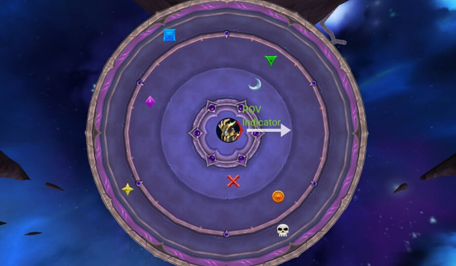

### Фаза 1

Пулите босса со стороны красной метки и пусть ваш рейд приманивает механики в центре комнаты.

Вы будете повторять эту перепозицию каждый раз, когда босс собирается использовать свое комбо из 4 способностей, это делает лазеры дракона более предсказуемыми и легче уклоняться от них.

Каждое комбо может произойти в другом порядке, но мы рекомендуем простое правило: **Сосите только если способность сосания — 1-й или 3-й каст.**

**Пример: **Если босс применяет фронтал первым, вы должны игнорировать вторую способность и двигаться вперед, как только фронтал закончится, третий каст всегда будет сосанием.

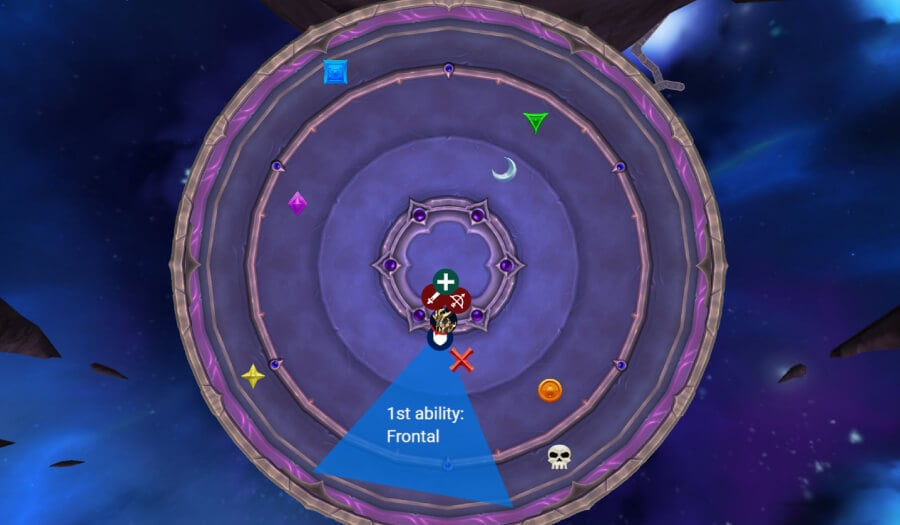

Позиционируйте рейд близко к **металлический край** на земле; заходить за нее рискованно, можно задеть лучами дракона.

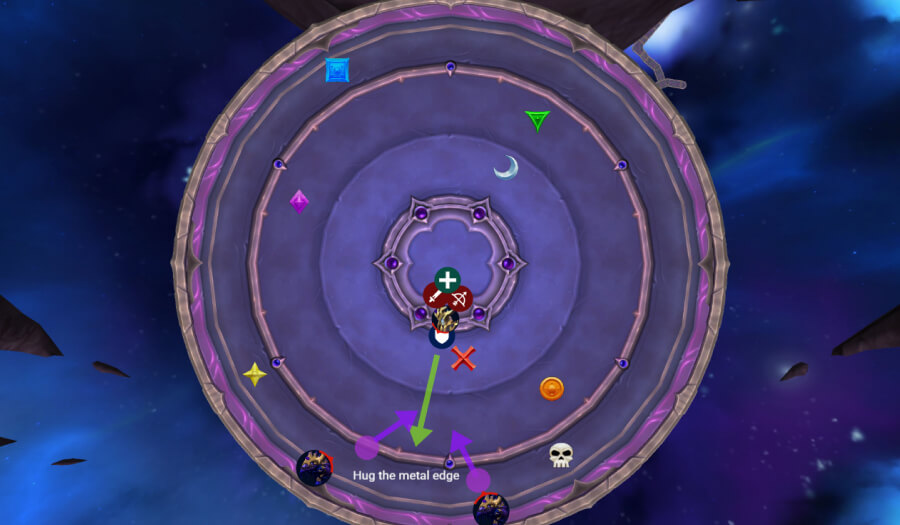

Во время движения уклоняйтесь от как можно большего количества лучей, но убедитесь, что вы внутри сосания. Если вы пропустите его, вам нужно будет исправить свои стаки, встав в танковое сосание с сильным защитным кулдауном, внешним или иммунитетом.

#### Танковые сосания

Это всегда солоит танк. Хмелевар и Воин превосходно справляются здесь, в то время как другим может понадобиться помощь. Вы можете отправить игрока с иммунитетом для помощи на определенных наборах, если защитные кулдауны слабы (например, Хмелевару часто это нужно в последнем наборе).

#### Назначения лекарей:

Назначения лекарей:

- 1-е сосание: все используют сильные личные кулдауны
- 2-е сосание: Зона антимагии / Барьер / Духовная связь
- 3-е сосание: Ободрение / Тотем предков / Зона антимагии

После каждого танкового комбо рейд получит Когти.

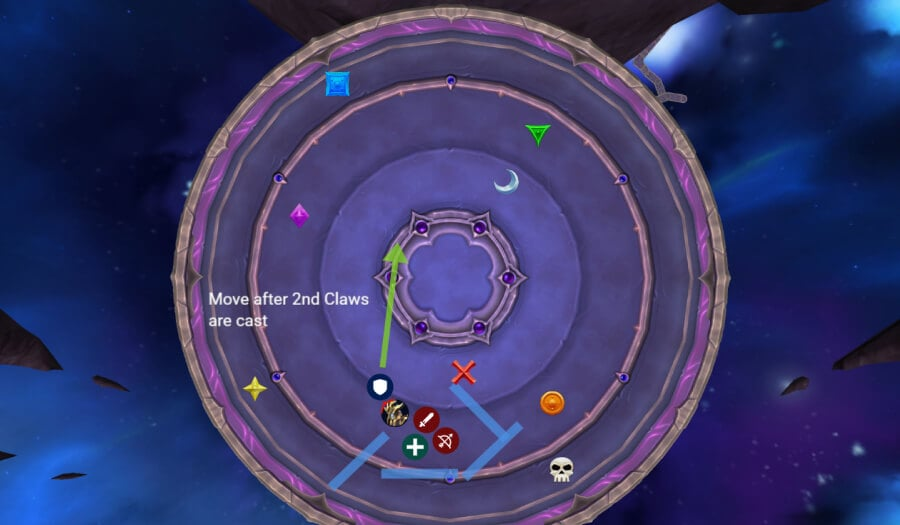

#### Когти

Каждое применение Когтя выбирает целью 10 игроков всего, но оно разделено на две волны по 5, первые пять получают его немедленно, затем еще пять через мгновение.

Когда вторая волна вот-вот выйдет, танк должен слегка перепозиционировать босса, в то время как рейд бросает свои когти позади области, в которой вы уже стоите. Это сохраняет пространство перед боссом свободным и упрощает движение.

Не усложняйте эту механику, просто безопасно бросьте свой коготь, не перекрывая другие, и убедитесь, что вас не задел чужой. Все остальные должны оставаться начеку и уклоняться от входящих когтей.

Игроки, пораженные [Изгнание](https://www.wowhead.com/ru/spell=1227529) не могут получить когти. Они должны заранее отойти, чтобы не задеть, так как они уже получают тяжелый периодический урон и еще один удар, вероятно, убьет их.

#### Духи

Как только вы перегруппируетесь и разберетесь с когтями, появятся Духи, и их нужно будет поймать. Количество, которое вам нужно поймать, зависит от того, сколько стаков Клятвенной связи вам не хватает.

Если вы умерли и были воскрешены, у вас будет 0 стаков, что значит, что вам нужно ловить 3 духа в каждом наборе.

Если вы чисто выполнили механики, количество духов за набор:

- **1-й набор:** 1 дух
- **2-й набор:** 2 духа
- **3-й набор:** 3 духа

Духи легко видны, когда они появляются, но ключ в том, чтобы поймать их в точном порядке их появления. Чтобы сделать это правильно, вы должны повернуться к ними персонажем, а не только камерой, когда они атакуют вас.

Если вы пропустите одного, вы вернете стак Клятвенной связи. В первом или втором наборе вы можете исправить это, сосав танковое комбо с сильным защитным кулдауном, внешним или иммунитетом.

Однако, если вы пропустите духа в третьем наборе, восстановления не будет, вы умрете.

Как только все духи успешно пойманы и механика разрешена, начинается Фаза 2, которая развивается почти так же, как в героическом режиме.

### Фаза 2

Круги теперь появляются случайно, так что найдите **безопасное место** после отбрасывания и переместите босса туда, как только они исчезнут.

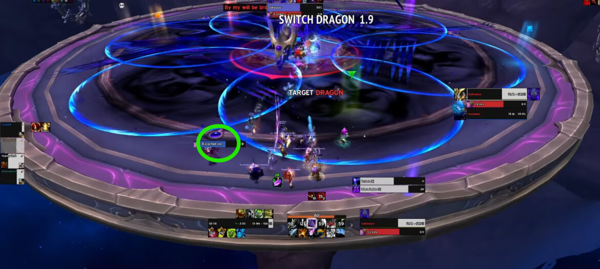

Здесь вам нужно понять 3-наборное комбо лазеров.

Первый всегда идет на текущего танка и будет размещен сбоку, прямо рядом с рейдом; в большинстве случаев это оказывается около зеленой метки. Они не двигаются и не нуждаются в уклонении.

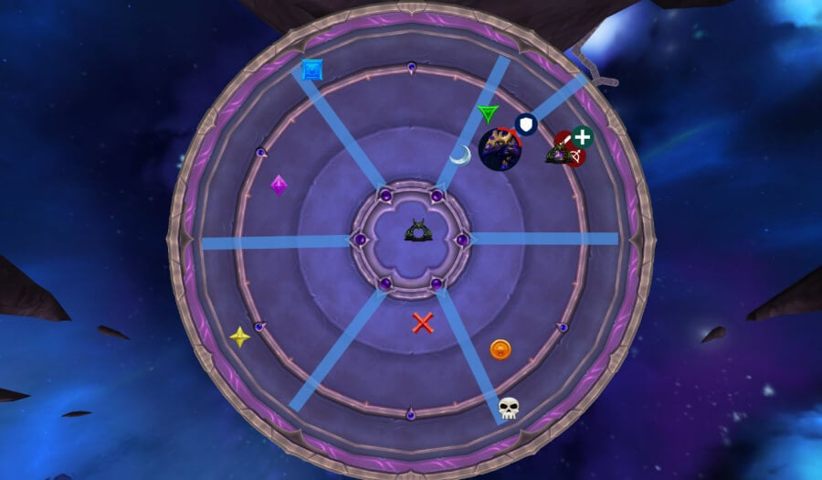

Второй набор имеет два варианта. Либо вы должны стоять на месте и быть плотно сгруппированными за металлической линией на полу, либо бежать в центр.

**ВАЖНО: **Вы никогда не используете Врата чернокнижника во втором наборе!

Если лазеры направлены наружу (как на изображении ниже), то рейд должен бежать в центр, и вам для этого нужен бафф скорости. Убедитесь, что вы бежите прямо, так как можете задеть сбоку.

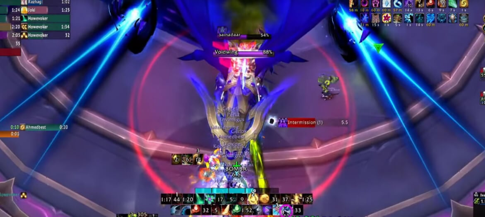

Если лазеры направлены внутрь, рейд остается!

Третий набор зависит от того, что было во втором наборе:

- Если вам пришлось бежать в центр, то используйте врата из центра
- Если вам пришлось остаться, то используйте врата в центр

#### Резюме комбо лазеров

В резюме, комбо лазера:

После этого комбо разделитесь на команды платформ.

### Платформы перерыва

При приземлении на платформы первое и самое важное — дать танку собрать всех аддов, прежде чем кто-то начнет наносить урон. Как только у него будет угроза, ваш главный приоритет убийства — всегда Титан, потому что если его каст завершится при 100 энергии, он убьет рейд.

Пусть кто-то будет готов отметить Принца на вашей стороне, это необходимо для правильной работы ВикАур прерываний.

Самая важная механика на платформе — щит Принца. Когда он его применяет, Жнецы должны прорваться сквозь него, чтобы убрать щит. Без этого вы не сможете его убить.

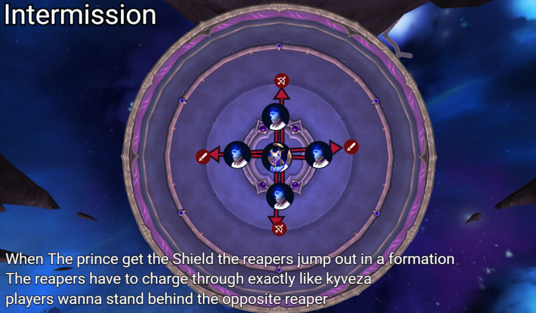

Все остальные должны пиксельно сгруппироваться плотно на танке. Это важно, потому что сразу после этого вы будете приманивать большой круг. Как только круг появится, уклонитесь от него и двигайтесь вместе с лазерами, как вы делали в героическом режиме.

Помните: вы должны убить каждого адда, прежде чем сможете покинуть платформу. Титан — ваш главный приоритет, но все должно умереть со временем.

Как только обе платформы зачищены, вы вернетесь в главную комнату, и Фаза 2 повторится точно так же, как раньше. Это значит:

- Уклоняйтесь от больших кругов.
- Найдите безопасное место.
- Снова разберитесь с 3-наборным комбо лазеров.

Когда вы входите в фазу сжигания, самое важное — иметь готовыми кулдауны ДПС, чтобы сжечь дракона. При текущих уровнях предметов даже возможно убить дракона полностью, что значительно сокращает Фазу 3.

Рейд должен равномерно распределиться вокруг дракона, чтобы уклонение от линий было проще, и убедиться, что лекари разбросаны так, чтобы у каждого игрока всегда был хотя бы один лекарь в радиусе.

В конце этой фазы весь рейд получит когти, но все они направлены вперед. Это значит, что вам просто нужно встать в одиночку и не в радиусе ближнего боя, чтобы вас не задели когти, идущие с противоположной стороны.

### Фаза 3

Если вы достигли Фазы 3, поздравляем, босс почти мертв. У этой фазы не так много механик, но каждая ошибка чрезвычайно карается и может легко привести к смертям или полному вайпу.

Немедленно в начале вы получите звезды. Три игрока ближнего боя и три дальнего боя всегда получают их, при этом одна из звезд ближнего боя всегда идет танку.

Правило размещения простое:

- Для звезд ближнего боя танк всегда размещает свою прямо на назначенной метке. Два других игрока ближнего боя идут слева и справа от танка.
- Для звезд дальнего боя один игрок встает на метку, а два других корректируют позицию, чтобы создать пространство между звездами.

Убедитесь, что между каждой звездой есть промежуток, нет причин размещать их слишком близко.

#### Первый набор

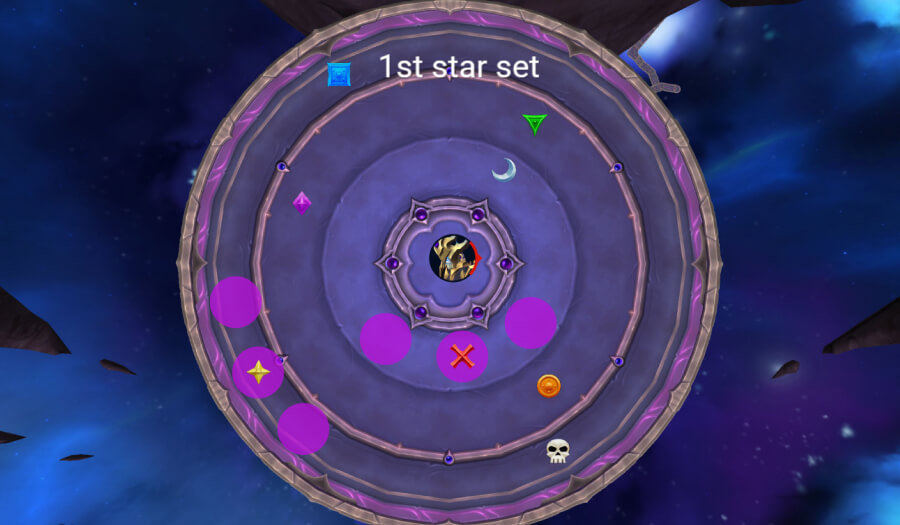

Игроки, размещающие звезды, должны быть **полностью подхилены** и используйте **сильные защитные кулдауны**, так как удары почти ваншоты.

Как только звезды размещены, всех схватят, **не сопротивляйтесь хвату**. Есть период отсрочки, прежде чем звезды станут активными, так что вы не получите урон, пока они размещены правильно.

После хвата вы начнете **уклонение от колец**. Здесь есть разные стратегии движения, но самое важное простое: **просто уклоняйтесь от колец**.

Для этого первого набора рейд должен **двигайтесь после 3-го хлопка**.

Затем вы столкнетесь с вашими **первый набор звездоубийц**. Двое игроков, ближайших к двум изображениям босса, получат лазеры, так что можно **заранее назначьте игроков** чтобы подобрать их и снизить рандом.

**Настоящий босс** всегда нацеливается на танка, поэтому танк должен **цельтесь в центральную звезду**.

Две иллюзии всегда появляются **позади босса**, чтобы можно было предвидеть направление входящих лазеров, это значительно упрощает наведение.

#### Второй набор

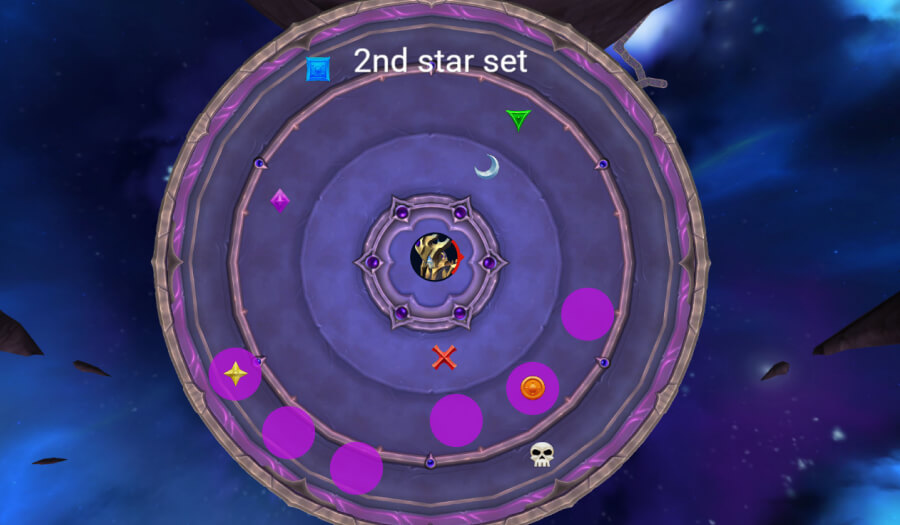

Игроки ближнего боя идут к оранжевой, а игроки дальнего боя — снова к желтой. На этот раз один игрок дальнего боя встает прямо на метку, а два других — на левую сторону от нее.

Для колец в этом наборе вы двигаетесь после 4-го хлопка.

#### Третий набор

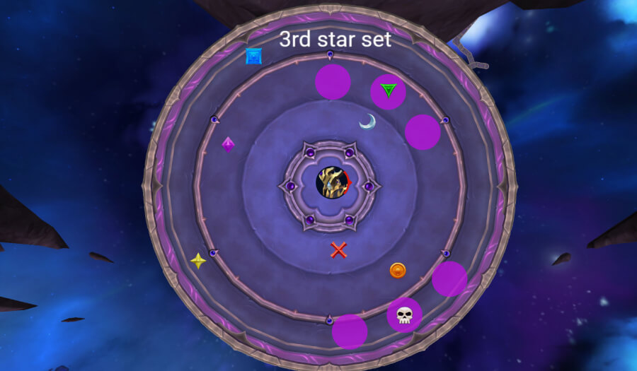

Игроки ближнего боя идут к зеленой, игроки дальнего боя — к черепу.

Для колец уклоняйтесь после 4-го хлопка, но оставайтесь в просвете еще на два хлопка, прежде чем бежать в центр.

После этого у вас будет еще два набора Звездоубийц и примерно 30 секунд до ярости, во время которых ничего нового не происходит.

Убейте босса до истечения таймера.