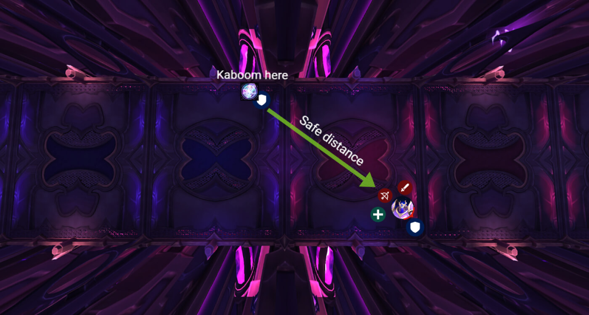
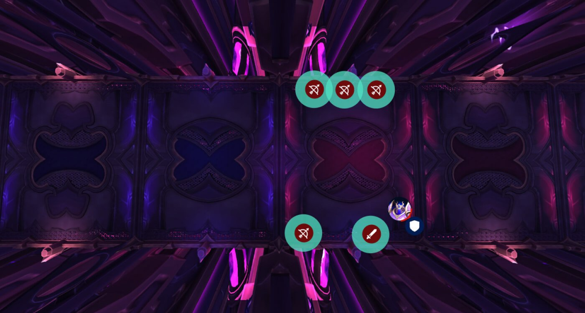
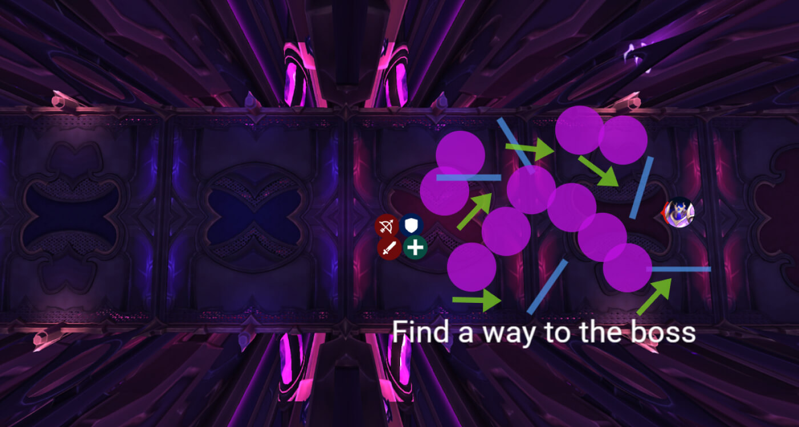

# Гайд на героического босса Плексус-страж

*Источник: Method, перевод с официальных русских названий способностей (Wowhead)*

## Упрощенный режим

**Фаза 1:**

- Танк, на которого нацелена [Чародейская пушка-уничтожитель](https://www.wowhead.com/ru/spell=1219263) должен убежать подальше от рейда, поменяйте танков после взрыва
- Сбрасывайте [Создание матрицы](https://www.wowhead.com/ru/spell=1219450) (ловушки) по сторонам, никогда в группе
- [Искореняющий залп](https://www.wowhead.com/ru/spell=1219532) (разделенное поглощение из 2 ударов):

**Интермиссия:**

- Сгруппируйтесь у босса до **100 энергии** чтобы избежать отбрасывания в стену смерти
- Пройдите лабиринт, не наступая в фиолетовые лужи и не попадая под лучи
- Когда появляется чародейская стена, используйте свою **дополнительную кнопку действия** чтобы пройти сквозь нее
- Уничтожьте щит босса, чтобы вернуться в Фазу 1

## Тактика

Этот первый босс не бросает слишком много сразу, но то, что он  бросает, однозначно ударит вас, если вы не будете уважать его немногочисленные механики. Фаза 1 — базовая, Фаза 2 — проверка передвижения, и вместе они как раз достаточно, чтобы разбудить вас перед настоящей болью дальше в рейде.

### Фаза 1

Не умирайте от очевидных вещей. Здесь всего три механики, но все они требуют координации.

#### Чародейская пушка-уничтожитель (танковый удар)

[Чародейская пушка-уничтожитель](https://www.wowhead.com/ru/spell=1219263) — это механика, которая вайпает рейды, которые не следят за ней.

- Всегда нацеливается на активного танка, поэтому танки должны меняться после применения, так как это накладывает дебафф на получаемый урон 100% на 45 секунд.
- Отмеченный танк должен убежать подальше, в идеале — туда, откуда вы начали бой.
- Этот взрыв наносит полный урон танку и уменьшенный урон рейду в зависимости от расстояния, так что расстояние — это жизнь.
- Это также оставляет лужу, не сбрасывайте ее в центре комнаты или там, где стоят люди.

**Совет для танков: **Пока один танк уводит пушку, другой должен держать босса у противоположной стены, чтобы создать пространство для рейда.

#### Создание матрицы (ловушки игроков)

Несколько игроков получат 6-секундный дебафф ([Создание матрицы](https://www.wowhead.com/ru/spell=1219450)) который оставляет ловушку по истечении времени.

- Вам нужно отбежать и сбросить ее в сторону, подальше от остальных.
- Эти ловушки не нужно взрывать, просто уберите их с пути и двигайтесь дальше.
- Точно избегайте оглушения в середине группы.

#### Искореняющий залп (ракеты с разделенным поглощением)

Во время [Искореняющий залп](https://www.wowhead.com/ru/spell=1219532), один случайный игрок получит круг вокруг себя, он отмечен для двух ракетных ударов подряд.

- Каждая ракета должна быть поглощена как минимум 3-4 игроками, иначе цель получит огромный урон.
- Подвох? Ракеты попадают с интервалом ~2 секунды и отбрасывают назад.
- Поэтому группа А должна поглотить первый удар, ее отбросит, а затем группа Б мгновенно подбегает для второго.
- Дебафф не накладывается, поэтому если вы можете обойти отбрасывание (как Рывок смерти рыцаря смерти или порталы чернокнижника), вы можете поглотить оба удара как герой.

### Интермиссия

Отбрасывание, лабиринт, паника. При 100 энергии босс прекращает все и запускает игроков в худший забег в их жизни.

#### Ход интермиссии

Сгруппируйтесь близко к боссу до 100 энергии, потому что вас сейчас отбросит назад, а за спиной — стена смерти.

Используйте способности передвижения, чтобы избежать отбрасывания в энергетическое поле.

Как только лабиринт сформируется, прокладывайте путь вокруг ловушек и лучей.

- Фиолетовые лужи замедляют и наносят урон. Избегайте их, всегда есть безопасный путь.
- Избегайте вращающихся лучей

Гигантская стена из чародейских лазеров приближается один раз за интермиссию. Используйте дополнительную кнопку действия, чтобы пройти сквозь нее.

Как только дойдете до босса, уничтожьте щит, чтобы остановить очищение и вернуть Фазу 1.

**Важное примечание:** С каждой интермиссией лабиринт становится длиннее и сложнее. Те же механики, просто больше расстояния и больше шансов ошибиться с маршрутом.