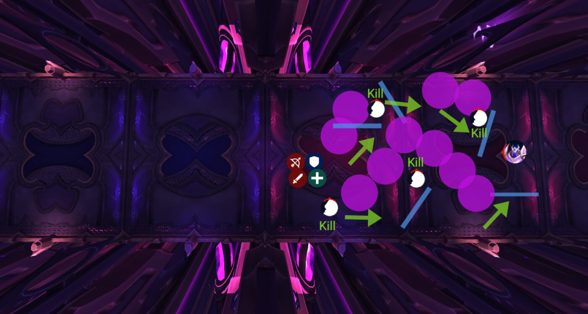

# Гайд на мифического босса Плексус-страж

*Источник: Method, перевод с официальных русских названий способностей (Wowhead)*

## Упрощенный режим

**Фаза 1:**

- Назначьте **2 группы поглощения** для [Искореняющий залп](https://www.wowhead.com/ru/spell=1219532)
- **Танк берет [Чародейская пушка-уничтожитель](https://www.wowhead.com/ru/spell=1219263)** подальше, сбросьте лужу позади рейда
- Игроки с [Создание матрицы](https://www.wowhead.com/ru/spell=1219450) ставьте ловушки в стороне
- **Следите за [Очистка зала](https://www.wowhead.com/ru/spell=1234733)** (лазерная стена), **используйте кнопку действия** чтобы пройти сквозь, иначе умрете

**Интермиссия:**

- Пройдите сквозь **медленные лужи и лучи лабиринта**
- **Уворачивайтесь от вращающихся лучей**
- **Используйте кнопку действия** чтобы пройти сквозь **лазерная стена**
- Убивайте **Нестабильные порождения** быстро

## Тактика

В мифике мало что меняется... но то немногое, что меняется, однозначно уничтожит ваш рейд, если его игнорировать**.** Бой все еще вращается вокруг четких поглощений, базового позиционирования и эффектной интермиссии.

### Корректировки Фазы 1

Вы делаете тот же бой, но теперь людям действительно нужно выполнять механики.

Все еще комбо из 2 ракет, и они все еще отбрасывают, поэтому все еще нужно разделенное поглощение.

Разница? Теперь **каждая ракета ДОЛЖНА попасть минимум в 5 игроков** или весь рейд получает сильный урон.

Вам понадобятся **четко назначенные команды поглощения**:

- Группа А поглощает ракету 1.
- Группа Б мгновенно заменяет их для ракеты 2.

Игроки с **технологии против отбрасывания** (Хватка смерти, возвращение через портал, рывки, Демонический круг и т.д.) могут дважды поглощать, используйте это, чтобы снизить нагрузку на назначения.

Чародейская лазерная стена [Очистка зала](https://www.wowhead.com/ru/spell=1234733) теперь появляется в Фазе 1, не только в интермиссии.

Выглядит так же, движется так же, и все еще **ваншотает любого, кто не использует дополнительную кнопку действия** чтобы пройти сквозь нее.

Убедитесь, что все знают, что это может произойти в основной фазе. Иначе это бесплатные смерти.

### Корректировки интермиссии

Механически все то же самое, просто больше вещей, от которых нужно уворачиваться, и несколько целей высокого приоритета.

Во время лабиринта, несколько **появлений аддов** начинают применять [Энергетическая перегрузка](https://www.wowhead.com/ru/spell=1235816), каждое применение наносит огромный урон и увеличивает получаемый урон от этой способности на 100%.

Проходя лабиринт, разделитесь на группы, потому что эти адды появляются в случайных точках лабиринта. Обычно милишники должны бежать вперед, а рейнджеры — разбираться с аддами по сторонам.