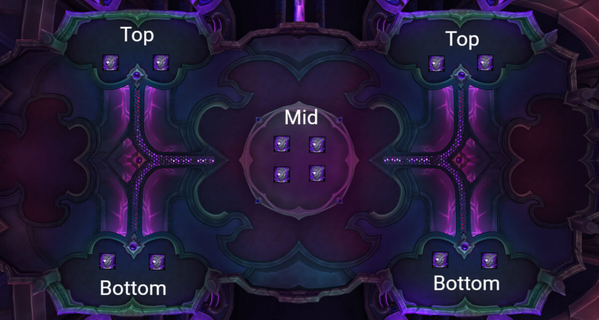
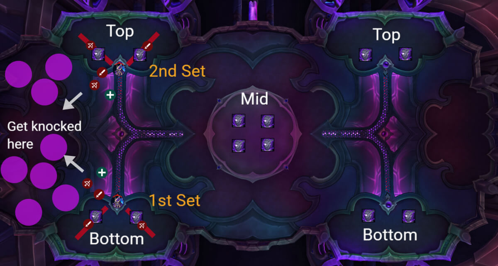
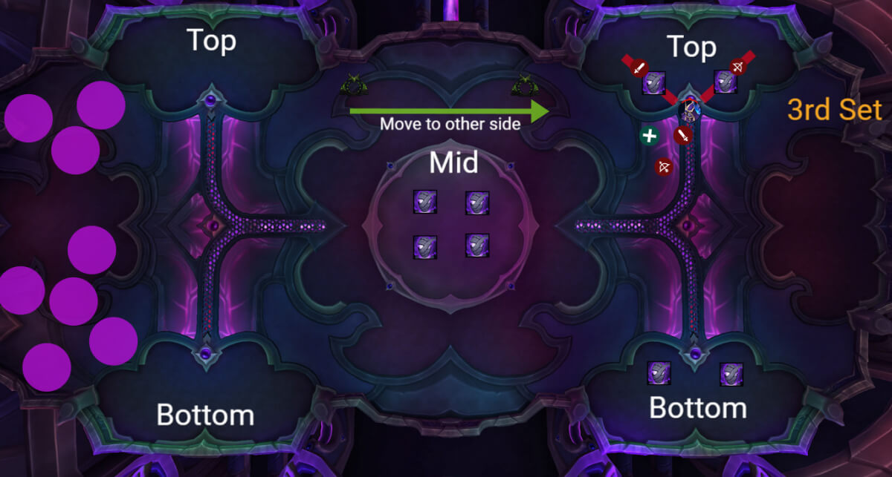
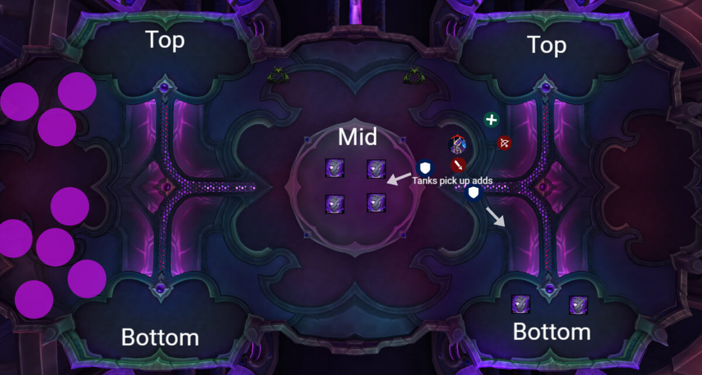
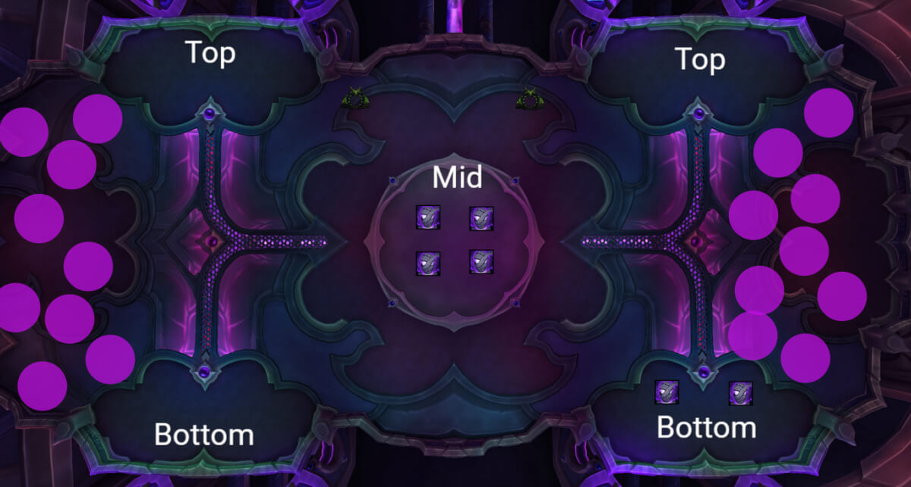

# Гайд на героического босса Связующий душ Наазиндри

*Источник: Method, перевод с официальных русских названий способностей (Wowhead)*

## Упрощенный режим

**Фаза 1 – Зачистка камер:**

- **Позиционирование ключевое:** Босс всегда применяет [Терзающая душу аннигиляция](https://www.wowhead.com/ru/spell=1227276) (2 сферы). Встаньте за 2 камеры, чтобы между вами никого не было, и уничтожьте их.
- **Сначала зачистите одну полную сторону (4 камеры = 2 применения)**, затем используйте портал через комнату и уничтожьте ещё 2 на противоположной стороне.
- **Если сферы попадут в игроков вместо камер**, вы провалили механику, **адды не появятся** и **[Имплозия сущности](https://www.wowhead.com/ru/spell=1227848) будет сильнее** позже.

**Переходная фаза – Волна аддов:**

- Любые оставшиеся камеры взрываются через [Имплозия сущности](https://www.wowhead.com/ru/spell=1227848), массивный рейдовый DoT, зависящий от количества активных камер.
- Соберите всех аддов (особенно магов), прерывайте, и стойте разреженно, чтобы избежать разделённого урона или цепного урона.
- **Зачищайте всё быстро.**

**Повтор фазы:**

- Камеры возрождаются.
- Начните с противоположной стороны, на которой закончили, затем повторите план зачистки.
- К этому моменту комната в основном покрыта лужами, **сфокусируйтесь на боссе и сбейте его до 3-й переходной фазы.**

**Дополнительные примечания по механике:**

- **[Стечение огня душ](https://www.wowhead.com/ru/spell=1225616):** Разойдитесь, если вы цель; сферы летят линией, не попадите под сферу другого игрока (большая потеря скорости и скорости передвижения).
- **Убийцы из Темной Стражи ([Внезапный удар клинком Бездны](https://www.wowhead.com/ru/spell=1227048)):** Следите за телепорт-ударом; избегайте скопления, когда они на поле.
- **Не провалите [Терзающую душу аннигиляцию](https://www.wowhead.com/ru/spell=1227276).** Пропущенные камеры означают больше аддов и более сильный DoT позже.

## Тактика

Этот бой целиком о **уничтожении камер душ**, уклонении от сфер и случайном перекрывании своего прогресса. Остальное — неважно.

По краям и в центре комнаты находятся **12 камер для связывания** (камеры), в каждой из которых находится **Неприкаянная душа**. Вы **не можете убить этих аддов**, пока их камера не будет уничтожена первой, и единственный способ сделать это — с помощью [Терзающей душу аннигиляции](https://www.wowhead.com/ru/spell=1227276), большой сферы, которую босс выпускает дважды за одно применение.

**Схема TL;DR:**

**Начните с одной стороны (Левой или Правой)** и позиционируйте босса **между двумя боковыми камерами**, это позволяет вашему рейду охватить обе.

2 нацеленных игрока **встают за каждую камеру**, **никто другой** не должен находиться между ними, иначе сфера будет поглощена и потрачена зря.

Если вы промахнетесь, адд останется невосприимчивым, и вас накажут на переходной фазе.

Сделайте эту расстановку для **2 применений Терзающей душу аннигиляции**, и вы должны уничтожить **4 камеры** на одной стороне. Так что убейте 2 камеры снизу, затем переключитесь наверх.

**Затем поменяйте стороны.**

После второго применения используйте **способности мобильности и портал Чернокнижника**, чтобы перейти на **другую сторону комнаты**, пропуская середину. Босс следует за рейдом.

Сделайте одно последнее [Терзающую душу аннигиляцию](https://www.wowhead.com/ru/spell=1227276), затем сломайте **ещё 2 камеры**.

Время от времени несколько игроков станут целями [Стечения огня душ](https://www.wowhead.com/ru/spell=1225616), это DoT, который каждую секунду наносит урон от тайной магии и в конце концов выпускает [Раздирающую душу сферу](https://www.wowhead.com/ru/spell=1226827) из поражённого игрока. Эти сферы летят прямой линией наружу от тела игрока и попадут в первого, с кем столкнутся, применяя неприятное замедление скорости передвижения на 30% и снижение скорости на 25%.

После этого [Имплозия сущности](https://www.wowhead.com/ru/spell=1227848) срабатывает и ломает **оставшиеся камеры**. Это главный момент переходной фазы: каждый адд, который всё ещё связан, будет освобождён.

Если вы **провалили [Терзающую душу аннигиляцию](https://www.wowhead.com/ru/spell=1227276) раньше**, чем больше камер взорвётся, тем **сильнее периодический урон по рейду**.

Адды появляются **из центра и с боков** камер, которые вы не зачистили, танки должны собрать всё.

Прерывайте **Магов из Темной Стражи**, оставайтесь **разобщёнными** для отскоков **Фазовых клинков**, и используйте разделённый урон/AoE, чтобы зачистить их.

После того как все адды мертвы, **камеры возрождаются**. Бой **повторяется** отсюда.

Теперь вы будете стоять ближе к **правой стороне** (если вы начали слева), и эта сторона, скорее всего, **чище от луж**.

Повтор: 2 [Терзающие душу аннигиляции](https://www.wowhead.com/ru/spell=1227276), чтобы сломать 4 камеры, поменяйте стороны, сломайте ещё 2.

Обращайтесь с отбрасываниями так же, как на левой стороне.

В комнате всё равно будут случайные лужи из-за неправильной позиции некоторых игроков, но поскольку лужи не растут, это не проблема, пока большинство луж размещено по бокам.

Вы получите ещё одну [Имплозию сущности](https://www.wowhead.com/ru/spell=1227848), переживите её, зачистите финальную волну.

Вам не нужно делать это в третий раз, просто **убейте босса** во время или после второй фазы Имплозии.