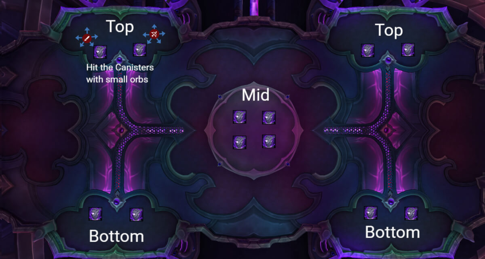
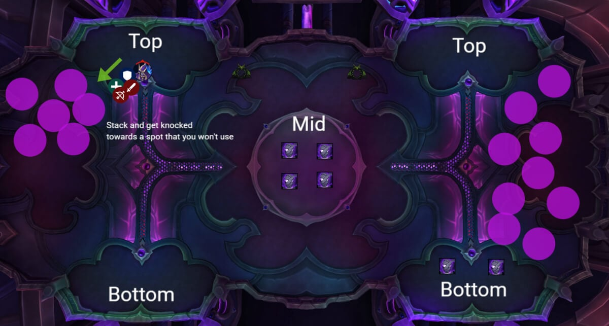
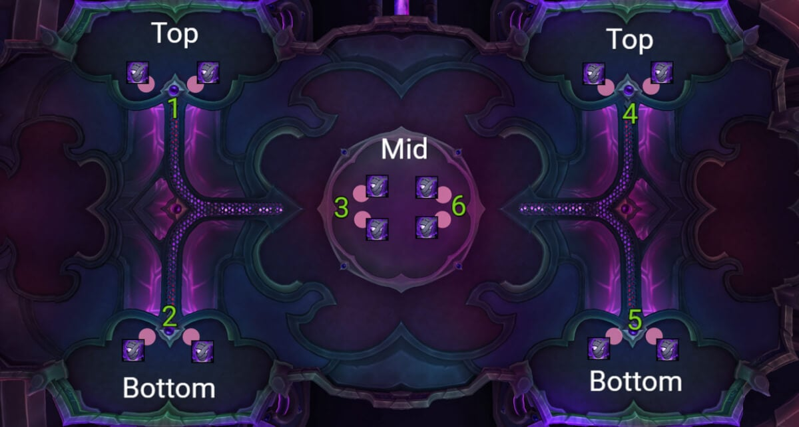

# Гайд на мифического босса Связующий душ Наазиндри

*Источник: Method, перевод с официальных русских названий способностей (Wowhead)*

## Упрощенный режим

- Ломайте камеры с помощью [Терзающей душу аннигиляции](https://www.wowhead.com/ru/spell=1227276), но сначала снимите с них [чародейские печати](https://www.wowhead.com/ru/spell=1246530), попадая по ним [сферами Стечения огня душ](https://www.wowhead.com/ru/spell=1225616).
- Сгруппируйтесь для **[Волны тайной магии](https://www.wowhead.com/ru/spell=1242088) отбрасывания**, чтобы лужи падали вместе.
- Разберитесь с аддами после [Имплозии сущности](https://www.wowhead.com/ru/spell=1227848): прерывайте Магов, разойдитесь для Фазовых клинков, зачистите всё.
- Бой повторяется (камеры возрождаются), так что повторяйте процесс до смерти босса.

## Механики

*(Нажмите на название способности, чтобы увидеть подробности)*

## Тактика

Этот босс сильно занерфлен и честно говоря должен считаться вторым боссом рейда. Мифические дополнения на самом деле не делают бой сложнее, и на практике вы, вероятно, могли бы убить его, просто используя героическую тактику. Тем не менее, поскольку мы серьёзная компания, вот гайд, который сделает бой для вас проще и чище.

### Основное изменение – защитные печати

Каждая камера для связывания теперь появляется с защитной печатью. Её нужно снять, прежде чем камеру можно будет уничтожить с помощью [Терзающей душу аннигиляции](https://www.wowhead.com/ru/spell=1227276).

**Как снять:** Игроки, нацеленные [Стечением огня душ](https://www.wowhead.com/ru/spell=1225616), выпустят **Раздирающие душу сферы**. Попадание одной сферой по камере достаточно, чтобы снять печать.

**Позиционирование:** Когда одновременно нацелены четыре игрока, вы почти всегда случайно попадёте по камере, но вы также можете аккуратно целиться, чтобы зачистить две одной сферой, или просто поставить по одному игроку за каждую камеру, убедившись, что стрелка указывает на неё.

Как только печать исчезнет, обращайтесь с камерой точно как на героическом: выстройте линию и сломайте её лучом Аннигиляции.

### Лужи от отбрасывания

Другой мифический поворот в том, что каждое [Волна тайной магии](https://www.wowhead.com/ru/spell=1242088) отбрасывание теперь оставляет за собой **перманентную лужу** там, где приземляется каждый игрок.

Эти лужи никогда не растут, но сохраняются до конца боя.

Чтобы комната оставалась управляемой, рейд должен **плотно сгруппироваться перед каждым отбрасыванием**, чтобы все лужи падали в одной контролируемой точке.

Это обычно жертвует небольшим куском комнаты, но оставляет остальное широко открытым.

### Всё остальное

Помимо печатей и луж, бой идентичен героическому, просто с большими цифрами:

- Сломайте шесть камер лучами Терзающей душу аннигиляции.
- Переживите [Имплозию сущности](https://www.wowhead.com/ru/spell=1227848), пока остальные взрываются.
- Убивайте аддов с прерываниями, разойдитесь для отскоков Фазовых клинков, и используйте разделённый урон/AoE, чтобы их зачистить.
- Повторите цикл ещё раз. После второй Имплозии босс должен умереть до начала третьего цикла.

### Рекомендуемый порядок зачистки

Изображение ниже показывает предложенный порядок зачистки комнаты.

