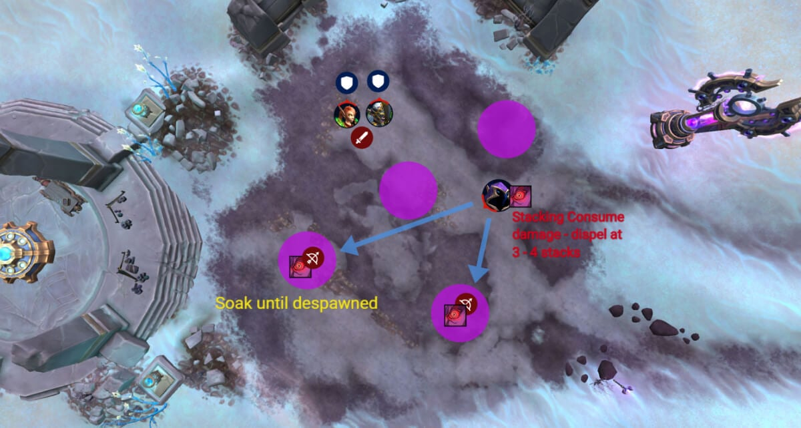
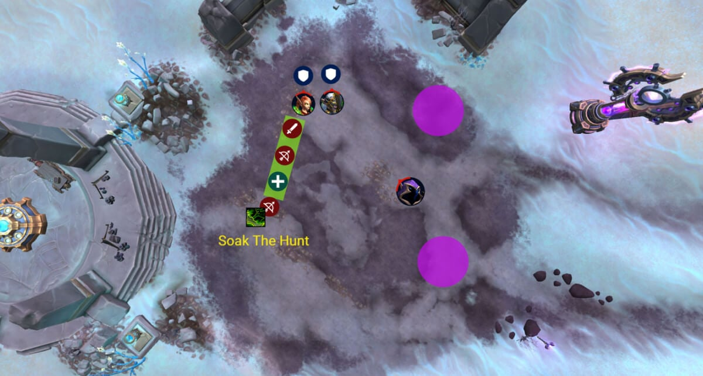
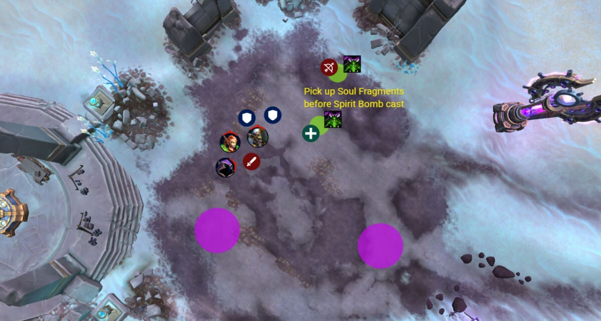
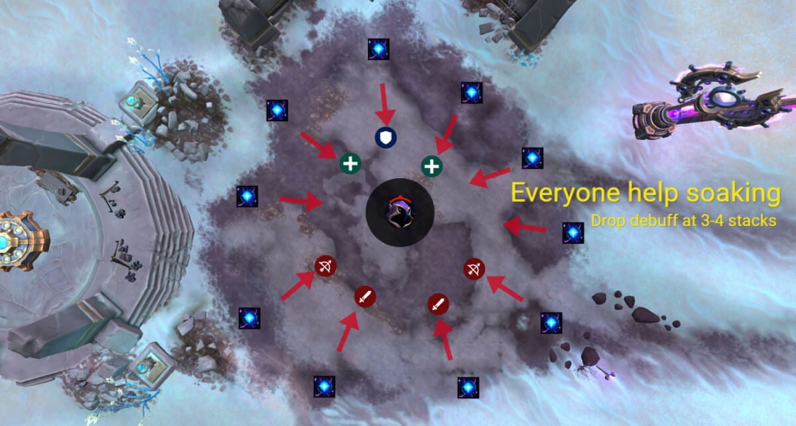
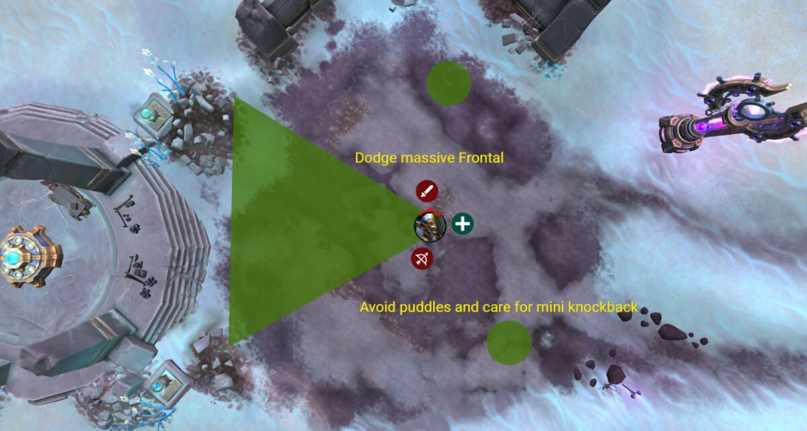

# Гайд на героического босса Охотники за душами

*Источник: Method, перевод с официальных русских названий способностей (Wowhead)*

## Упрощенный режим

Фаза 1:

- Фокусируйтесь на Адарус первым, заодно кливая остальных
- Слейте [Гнев пожирателя](https://www.wowhead.com/ru/spell=1222232) лужи с помеченными игроками, чтобы они исчезли
- Ротируйте [Гнев пожирателя](https://www.wowhead.com/ru/spell=1222232) дебафф каждые 3-4 стака через диспелы
- Слейте Охоту линию с 4-5 игроками, разойдитесь внутри линии, чтобы не кливать друг друга
- Уворачивайтесь от [Пустотный шаг](https://www.wowhead.com/ru/spell=1227355) , [Танец клинков](https://www.wowhead.com/ru/spell=1241306) , и другие круги
- Смена танка на [Луч Скверны](https://www.wowhead.com/ru/spell=1218103) чтобы избежать комбо от [Клинок Скверны](https://www.wowhead.com/ru/spell=1225127)
- Подберите фрагменты души после [Раскол](https://www.wowhead.com/ru/spell=1241833) чтобы предотвратить тяжелый танковый урон
- Убедитесь, что все фрагменты души собраны до [Бомба души](https://www.wowhead.com/ru/spell=1242259) , иначе рейд получит серьезный урон

Интермиссия 1 (Адарус):

- Сливайте пурпурные сферы до того, как они достигнут босса
- Подберите 3-4 орба, дождитесь спадения дебаффа, повторяйте
- Не прикасайтесь к центру, он убивает

Интермиссия 2 (Веларин):

- Уворачивайтесь от огненных линий
- Двигайтесь только если ваша линия пересекает чью-то

Интермиссия 3 (Илисса):

- Оставайтесь близко к боссу
- Следите за отбрасываниями и уворачивайтесь от фронтального конуса ( [Опустошение Скверны](https://www.wowhead.com/ru/spell=1227117) )

Финальная фаза:

- Повторяйте механики как раньше
- Сведите всех боссов примерно до 20% и убейте их одновременно
- Несинхронизированные убийства означают пульсирующий рейдовый вайп-механик

## Тактика

Этот бой целиком посвящен убийству всех трех боссов одновременно , иначе оставшиеся в живых боссы будут пульсирующий AoE пока не вайпнит . Так что балансируйте урон и тщательно планируйте фазу сжигания, без случайных кливов на 20%.

Бой начинается с Адарус как рекомендуемая первая цель. Он телепортируется и реже находится в зоне клива, поэтому лучше нанести на него фокус-урон рано, заодно кливая двух других по мере их приближения.

Сразу после пула, два пустотных круга появятся, это [Гнев пожирателя](https://www.wowhead.com/ru/spell=1222232) и их нужно слить, иначе рейд получит урон. Два случайных игрока получат дебафф и теперь должны нести ответственность за слив пурпурных луж которые появляются в течение боя. Стоите в луже, пока она полностью не исчезнет, если уйдете рано, она вырастет заново.

Пока держите дебафф, каждый [Поглощение](https://www.wowhead.com/ru/spell=1234565) каст бьет сильнее и накладывает поглощение исцеления . Это накапливается через [Бесконечный голод](https://www.wowhead.com/ru/spell=1222310) , поэтому лекари должны снимать дебафф и передавать его другому. Он всегда перескакивает на ближайший игрок , если только он уже не на них. Цельтесь в снятие около 3-4 стаков на человека.

Веларин выберет случайного игрока и атакует его Охоту . Вам понадобится 4-5 игроков стоя в линии, чтобы слить удар. Каждый сливающий получает круг, который заставляет их разойтись , поэтому не стойте друг на друге в линии.

Целевой игрок может отойти дальше, чтобы удлинить линию и дать больше места для слива.

Другие способности, такие как [Пустотный шаг](https://www.wowhead.com/ru/spell=1227355) , [Голодный взмах](https://www.wowhead.com/ru/spell=1227685) , or [Танец клинков](https://www.wowhead.com/ru/spell=1241306) — это простые увороты. Они хорошо телеграфированы и не требуют особой обработки, просто не стойте на месте в плохом.

Танки , с другой стороны, имеют полно работы:

Лекари будут вас ненавидеть, если люди будут получать урон от избегаемых способностей; поглощения исцеления, рейдовые удары и постоянный тиковый урон от танков делают этот бой очень требовательный к исцелению бой . Не усугубляйте ситуацию, танкуя круги лицом.

Перед каждой интермиссии , убедитесь, что все пурпурные лужи ( [Наступающее забвение](https://www.wowhead.com/ru/spell=1235045) ) очищаются с помощью игроков с [Гнев пожирателя](https://www.wowhead.com/ru/spell=1222232) . Это освобождает пространство и снижает шанс случайного урона во время фаз движения.

Адарус перемещается в центр и становится недоступным для атаки. Пурпурные сферы появляются по краю и плывут к нему. Если они достигнут центра, рейд получит тяжелый урон.

Игроки должны перехватить эти сферы , но каждый подобранный орб дает накапливающийся DoT . Дебафф длится 4 секунды, поэтому нужно подберите 3-4 сферы , дождитесь его спадения, затем подбирайте еще. Только не дайте им достичь босса.

The центр комнаты мгновенно убивает , так что смотрите под ноги.

Это Огненная линия в стиле Фиракка фазе.

Несколько игроков получают линии, исходящие из них, и они должны двигаться только если они пересекаются с кем-то другим . Все остальные просто уворачиваются.

Эта интермиссия поострее. Арена имеет мини-отбрасывания выходящие часто, и Илисса кастует большой фронтальный конус ( [Опустошение Скверны](https://www.wowhead.com/ru/spell=1227117) ) перед ней. Старайтесь оставаться как можно ближе к боссу и используйте мобильные способности чтобы увернуться от фронтала.

Следите, куда прыгает босс, бегите туда как можно скорее, не стоя в круге. Как только босс приземлится, зайдите за нее. Повторяйте до конца интермиссии.

Если вас откинут и вы приземлитесь в луче, вы труп.

После трех интермиссий цикл начинается заново. Продолжайте сливать лужи, ротировать дебаффы, уворачиваться от линий и управлять сменами танков и фрагментами душ.

В конце концов, вам нужно будет синхронизировать всех боссов примерно на 20% и провести контролируемое сжигание. Жмите кулдауны и нукайте всех троих вместе, чтобы избежать энрейджа.

Этот бой целиком посвящен убийству всех трех боссов одновременно , иначе оставшиеся в живых боссы будут пульсирующий AoE пока не вайпнит . Так что балансируйте урон и тщательно планируйте фазу сжигания, без случайных кливов на 20%.

Бой начинается с Адарус как рекомендуемая первая цель. Он телепортируется и реже находится в зоне клива, поэтому лучше нанести на него фокус-урон рано, заодно кливая двух других по мере их приближения.

#### Механики ранней фазы

Сразу после пула, два пустотных круга появятся, это [Гнев пожирателя](https://www.wowhead.com/ru/spell=1222232) и их нужно слить, иначе рейд получит урон. Два случайных игрока получат дебафф и теперь должны нести ответственность за слив пурпурных луж которые появляются в течение боя. Стоите в луже, пока она полностью не исчезнет, если уйдете рано, она вырастет заново.

Пока держите дебафф, каждый [Поглощение](https://www.wowhead.com/ru/spell=1234565) каст бьет сильнее и накладывает поглощение исцеления . Это накапливается через [Бесконечный голод](https://www.wowhead.com/ru/spell=1222310) , поэтому лекари должны снимать дебафф и передавать его другому. Он всегда перескакивает на ближайший игрок , если только он уже не на них. Цельтесь в снятие около 3-4 стаков на человека.

#### Охоту

Веларин выберет случайного игрока и атакует его Охоту . Вам понадобится 4-5 игроков стоя в линии, чтобы слить удар. Каждый сливающий получает круг, который заставляет их разойтись , поэтому не стойте друг на друге в линии.

Целевой игрок может отойти дальше, чтобы удлинить линию и дать больше места для слива.

#### Механики передвижения и танков

Другие способности, такие как [Пустотный шаг](https://www.wowhead.com/ru/spell=1227355) , [Голодный взмах](https://www.wowhead.com/ru/spell=1227685) , or [Танец клинков](https://www.wowhead.com/ru/spell=1241306) — это простые увороты. Они хорошо телеграфированы и не требуют особой обработки, просто не стойте на месте в плохом.

Танки , с другой стороны, имеют полно работы:

- [Луч Скверны](https://www.wowhead.com/ru/spell=1218103) бьет цель Веларин и немедленно вызывает [Клинок Скверны](https://www.wowhead.com/ru/spell=1225127) заряд. Танк, который получает [Луч Скверны](https://www.wowhead.com/ru/spell=1218103) получит повышенный урон от [Клинок Скверны](https://www.wowhead.com/ru/spell=1225127) , поэтому нужно сменить танка непосредственно перед ударом.
- [Раскол](https://www.wowhead.com/ru/spell=1241833) бьет текущую цель Илиссы и порождает фрагменты души . Остальные игроки должны быстро забежать и подобрать их. Пока они активны, танк получает массивный бонусный урон .
- Через несколько секунд Илисса кастует [Бомба души](https://www.wowhead.com/ru/spell=1242259) . If оставлены какие-либо фрагменты души , рейд получает огромный тиковый урон и получает поглощение . Если все собраны, это просто умеренный AoE. Так что собирайте души!

Лекари будут вас ненавидеть, если люди будут получать урон от избегаемых способностей; поглощения исцеления, рейдовые удары и постоянный тиковый урон от танков делают этот бой очень требовательный к исцелению бой . Не усугубляйте ситуацию, танкуя круги лицом.

Перед каждой интермиссии , убедитесь, что все пурпурные лужи ( [Наступающее забвение](https://www.wowhead.com/ru/spell=1235045) ) очищаются с помощью игроков с [Гнев пожирателя](https://www.wowhead.com/ru/spell=1222232) . Это освобождает пространство и снижает шанс случайного урона во время фаз движения.

#### Интермиссия 1 - Адарус

Адарус перемещается в центр и становится недоступным для атаки. Пурпурные сферы появляются по краю и плывут к нему. Если они достигнут центра, рейд получит тяжелый урон.

Игроки должны перехватить эти сферы , но каждый подобранный орб дает накапливающийся DoT . Дебафф длится 4 секунды, поэтому нужно подберите 3-4 сферы , дождитесь его спадения, затем подбирайте еще. Только не дайте им достичь босса.

The центр комнаты мгновенно убивает , так что смотрите под ноги.

#### Интермиссия 2 - Веларин

Это Огненная линия в стиле Фиракка фазе.

Несколько игроков получают линии, исходящие из них, и они должны двигаться только если они пересекаются с кем-то другим . Все остальные просто уворачиваются.

#### Интермиссия 3 - Илисса

Эта интермиссия поострее. Арена имеет мини-отбрасывания выходящие часто, и Илисса кастует большой фронтальный конус ( [Опустошение Скверны](https://www.wowhead.com/ru/spell=1227117) ) перед ней. Старайтесь оставаться как можно ближе к боссу и используйте мобильные способности чтобы увернуться от фронтала.

Следите, куда прыгает босс, бегите туда как можно скорее, не стоя в круге. Как только босс приземлится, зайдите за нее. Повторяйте до конца интермиссии.

Если вас откинут и вы приземлитесь в луче, вы труп.

#### Финальные замечания

После трех интермиссий цикл начинается заново. Продолжайте сливать лужи, ротировать дебаффы, уворачиваться от линий и управлять сменами танков и фрагментами душ.

В конце концов, вам нужно будет синхронизировать всех боссов примерно на 20% и провести контролируемое сжигание. Жмите кулдауны и нукайте всех троих вместе, чтобы избежать энрейджа.