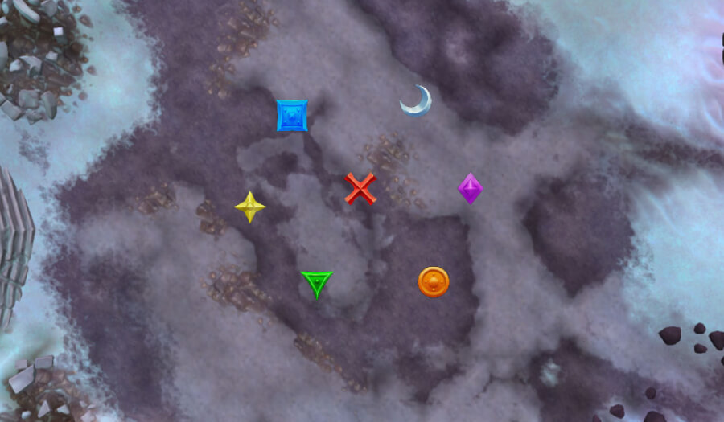
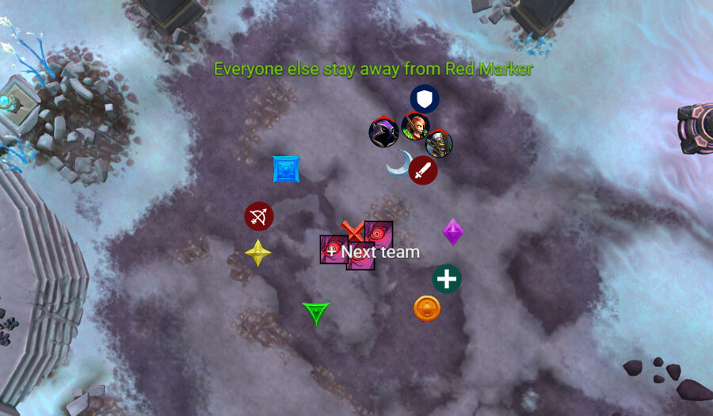
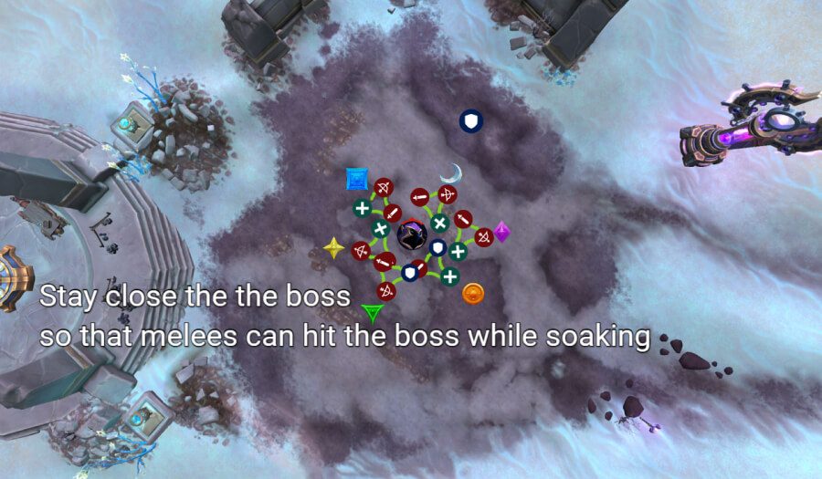
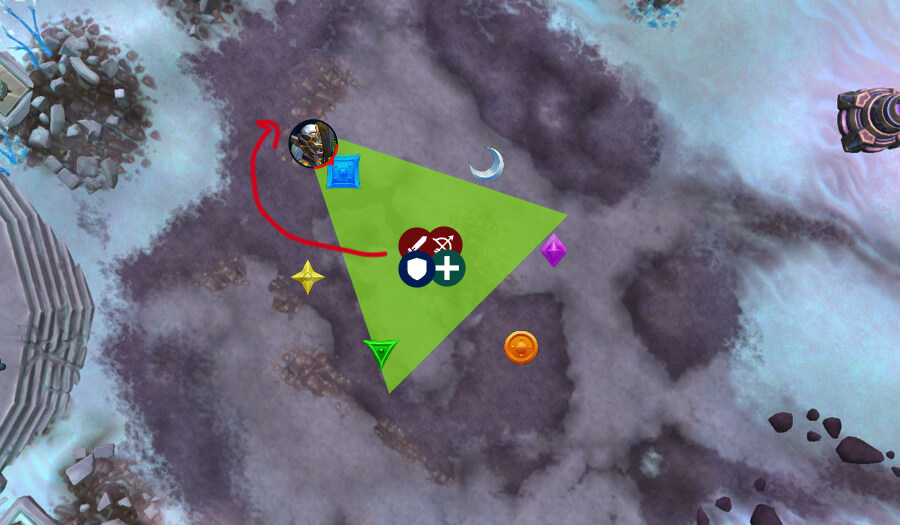
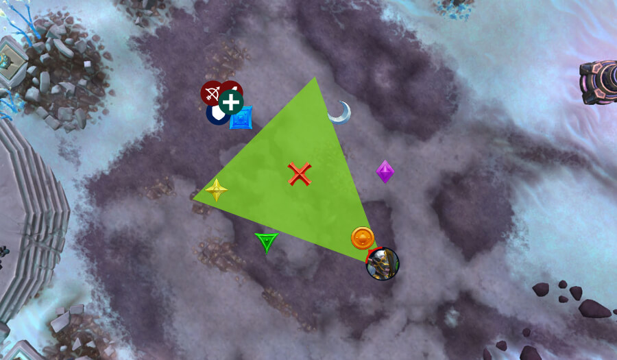

# Гайд на мифического босса Охотники за душами

*Источник: Method, перевод с официальных русских названий способностей (Wowhead)*

## Упрощенный режим

Общее:

- Возьмите дополнительного лекаря; исцеление — главная сложность.
- 3 фиксированные команды обрабатывают [Гнев пожирателя](https://www.wowhead.com/ru/spell=1222232) . Лекари диспелят себя/партнеров. Без массового диспела.
- 3 игрока (желательно мили) сливают танковые души, но никогда если у них есть [Гнев пожирателя](https://www.wowhead.com/ru/spell=1222232).

Фаза 1:

- Охоту : 3 заряда, каждый требует 3-4 сливающих. Используйте иммунитеты/внешки для соло. 1-я: мили сливает, если не соло. 2-я: рендж сливает, если не соло. 3-я: кто угодно без дебаффа, если не соло.
- [Гнев пожирателя](https://www.wowhead.com/ru/spell=1222232) : Команды сливают лужи возле Илиссы, затем грип, затем продолжают сливать.
- После 3 Охот: команда с дебаффом + следующая команда стакаются на Красном маркере, чтобы передать дебафф.
- Лекари: следите за танками и готовьтесь к [Бомба души](https://www.wowhead.com/ru/spell=1242259) поглощения.
- Всегда диспелите сразу после окончания интермиссии.

Интермиссии:

- 1 и 2: Идите к назначенному маркеру, сливайте сферы, уворачивайтесь от линий, оставайтесь близко (цепи).
- 3: Стакайтесь на Красном маркере перед началом > бегите влево/за босса при первом прыжке > выйдите из радиуса, если второй прыжок через всю комнату > реагируйте на третий (см. тактику для подробностей).
- После Интермиссии 3: короткая Ф1, убейте Илиссу первой для дополнительного времени позже.

## Тактика

Этот бой — значительное повышение сложности по сравнению с Героическим. Однако, благодаря своей структурированности, бой кажется менее хаотичным и более скриптованным, как только вы поймете поток.

Мы рекомендуем взять дополнительного лекаря сюда. В бою нет реального чека на урон, но требования к исцелению чрезвычайно высоки.

Вам понадобятся 3 выделенные команды чтобы обработать [Гнев пожирателя](https://www.wowhead.com/ru/spell=1222232) дебафф.

Рекомендуемый состав:

Четко назначьте диспелы. Каждый лекарь должен всегда диспелить себя или своего партнера. Это означает, что те же 3 лекаря всегда будут обрабатывать диспелы.

Массовый диспел не рекомендуется, если все 3 дебаффа снимаются одновременно, рейд получает слишком много урона, без шанса кастануть исцеление между ними.

Вам также нужны 3 игрока (желательно мили) чтобы слить танковые души . Это назначение более гибкое и может быть кем угодно, если только у них сейчас нет [Гнев пожирателя](https://www.wowhead.com/ru/spell=1222232) , в этом случае он бьет слишком сильно.

### Фаза 1

Маркеры: Расставьте маркеры перед пулом. Они в основном используются для интермиссий, но также помогают с позиционированием во время Охоту сливающие.

#### Охоту

Это самая сложная механика в Мифике.

Три игрока поочередно нацеливаются Охоту . Каждый заряд Охоты должен быть слит как минимум 3-4 игроками, хотя многие спеки могут соло с иммунитетами или внешками. Сливающие игроки также должны разойтись в линии, чтобы не задеть друг друга.

Общее правило:

- 1-я цель: Если возможно, соло. Иначе, мили сливает.
- 2-я цель: Если возможно, соло. Иначе, рендж сливает.
- 3-я цель: Если возможно, соло (Дисперсия, Защита от заклинаний и т.д.). Иначе, кто угодно без дебаффа сливает.

Советы:

- Соло? Держите линию очень короткой, чтобы никто другой не попал под удар.
- Внешки, такие как Растяжение времени, делают соло без иммунитета безопаснее.

#### [Гнев пожирателя](https://www.wowhead.com/ru/spell=1222232)

Это вторая ключевая механика. В начале боя ваша первая назначенная команда подбирает три лужи, чтобы получить дебафф.

Правило простое:

- Всегда сливайте лужи ближайшие к Илиссе, потому что туда рейд будет притянут для Охоты.
- После грипа продолжайте сливать, если только не нужно остановиться и помочь перекрыть линию Охоты.

#### Передача дебаффа

Как только все 3 заряда Охоты выполнены, 3 игрока с дебаффом плюс 3 игрока из следующей команды стакаются на Красный маркер . Вещи, которые нужно помнить:

- Дебафф перескакивает только на игроков без него.
- Стоя близко друг к другу, гарантируется передача правильной следующей команде.

Вторая и третья команды повторяют тот же паттерн:

- Очистите область вокруг боссов
- Обрабатывайте грип и Охоту
- Перейдите на Красный маркер и получите диспел

Другие замечания:

- Лекари должны внимательно следить за ХП танков и быть готовыми к поглощения исцеления ( [Бомба души](https://www.wowhead.com/ru/spell=1242259) ) .
- Всегда диспелите сразу после окончания интермиссии, назовите маркер встречи

### Интермиссии

Интермиссии не сильно отличаются от героического, но каждый игрок связан с 2 другими. Случайное движение наказывается, поэтому осведомленность и дисциплина — ключевые факторы.

Интермиссии 1 и 2: Идите к назначенному маркеру. Сливайте свои сферы, уворачивайтесь от линий, и не отходите далеко, иначе цепь подтянет вас обратно и нанесет урон.

3-я интермиссия немного сложнее, потому что здесь нужно много двигаться, будучи связанными вместе, и WeakAuras здесь не помогут.

Стакайтесь вместе на красном маркере прямо перед началом интермиссии, и ждите, чтобы увидеть, куда босс прыгнет первым.

Правило здесь — бежать влево и зайти за босса.

Когда вы там, следите, куда следующий прыжок, и если он через всю комнату, вы можете выйти из радиуса, стоя на месте и прижавшись к краю.

На 3-м прыжке нужно просто соответствующим образом отреагировать.

Как только вы закончите 3-ю интермиссию, у вас снова будет очень короткая Ф1, в которой вам нужно сначала убедиться, что вы убили Илиссу первой, потому что это даст вам дополнительное время в интермиссии энрейджа, если вы до нее дойдете, но убедитесь, что другие боссы хотя бы ниже 10%.